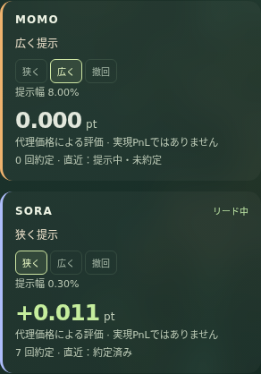
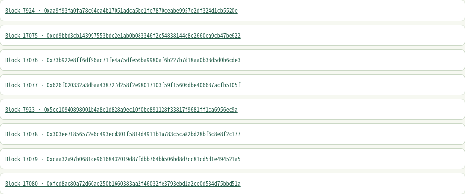
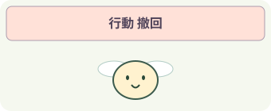

# 03 Aqua — 共有流動性を出す・引く

流動性を出す？ 広げる？ 引き上げる？

あなたは流動性実験の観察者です。2匹は価格変化を受け、狭い提示・広い提示・撤回を選びます。テストトークンの実TXと、その評価を一緒に見ます。

[全神経版の印刷シート](http://127.0.0.1:8812/guides/sheet.html?app=aqua&mode=full&lang=ja) / [従来版の印刷シート](http://127.0.0.1:8800/guides/sheet.html?app=aqua&mode=browser&lang=ja)。画面内と同じ説明データから生成しています。英語はシートの言語選択で切り替えられます。

## 01 はじめてのプレイ

1. Aquaページで「自律運用をはじめる」を押します。価格履歴を入力にして判断が始まります。
2. tight（30 bps）・wide（800 bps）・withdrawの選択と、TX・約定・代理報酬を見ます。TX処理を待つため、採餌よりゆっくり進みます。
3. 「学び直す」で戦略選択を学び直します。処理中はフェーズ表示を確認し、完了後に採用Policyと評価を比較します。

途中で止めるには「停止」。進行中の動作が完了してから止まります。

## 02 画面の見方

実画面の切り抜きです。数値は撮影時の例です。

### 1. 操作する場所

### 2. ハエが反応する場所

### 3. 状態と成績

### 4. ブロックチェーンの証拠

| 表示 | 意味 |
| --- | --- |
| ハエと枠＝選択中の戦略 | 全神経版は狭い提示・広い提示・撤回の選択、提示幅、約定回数を表示します。価格変化は別ペアのUniswap履歴を代理入力に使用し、実現PnLと区別した評価ポイントを表示します。 |
| ハエ＝流動性を制御する方策 | 神経活動から戦略を選びます。共有ウォレットの仮想提示額を増やしても、実残高が増えるわけではありません。 |

### 状態と吹き出し

正の代理報酬を人工的な摂食へ、撤回を休息へ対応づけています。満腹度と蓄えは次の入力に戻ります。全神経版のEnergyは0.7固定です。これは実際のハエが手数料を食べるという意味ではありません。

狭い提示＝取引を受け入れやすい設定、広い提示＝より広いスプレッド、撤回＝戦略を取り下げる判断。？は学習中の表示です。神経領域の名前から恐怖・欲望を読み出しているわけではありません。

### 吹き出し図鑑

実際の表示文言に合わせた説明用の模式図です。全神経版のカードと従来版の感情風の吹き出しは別の表示です。

#### 全神経版・7神経比較モード：状態と選択

**？**：readoutを学習しているフェーズ。ハエの移動表示が止まります。収集や評価の全時間に出る印ではなく、学習処理が短いと見逃すこともあります。

**行動 狭いスプレッド**：30 bpsで流動性を提示する判断。取引が成立したかどうかは約定とTXで別に確認します。

**行動 広いスプレッド**：800 bpsで広く提示する判断。人工的な注文成立ルールにより、提示しても約定しない場合があります。

**行動 撤回**：戦略を取り下げる判断。dockのTXが確定したかも確認します。ハエが恐怖を感じた証拠ではありません。

#### 従来のブラウザー版：吹き出し

**ごはん、どうぞ！**：shipの戦略案。学習係数をかけた応答が0.045未満で、強い生の応答もない場合。約定済みの意味ではありません。

**うーん…少しだけ。**：cautiousの戦略案。応答が0.045以上で、撤回条件には達していない場合。仮想提示量を小さくします。

**こわい！ひと休み。**：dockの判断。生の応答または係数調整後の応答が0.1以上。実際に撤回されたかはTX確定で確認します。

### 成績と目標

約定の残高変化を、別ペアの次のUniswap価格比で評価した「代理報酬」を競います。feesは手数料相当の差分です。どちらもウォレットの実現PnLやLVR回避の実証とは異なります。

| 表示 | 意味 |
| --- | --- |
| fees / 手数料 | 実テスト約定の入力額と出力額の差の累計。次の価格による不利な評価はここに含まないため、Rewardとは一致しません。 |
| Reward / 代理報酬 | 残高差を次の価格比で評価した増分。ウォレット全体のPnL、実現利益、LVRの推定値ではありません。 |
| bps / 約定条件 | 100bps＝1%。この実験では広い提示は直近変動が200bps以上の場合だけ人工takerが受け入れます。実際の市場需要を推測したものではありません。 |

## 03 学び直して、もう一度

収集＝実際に動かして観測・行動・結果を保存。学習＝保存した神経特徴と報酬からreadoutを更新。評価＝別の実行で旧方策と候補を比較。改善した個体だけ採用し、v2などの方策番号が次の判断へ反映されます。神経接続そのものは固定です。

「評価中」は候補を試している途中で、まだ採用を意味しません。「完了」はその実行の終了、「停止」はユーザーの操作による中断です。？はreadoutを学習している間の表示で、短時間の学習では見えないこともあります。

行動名とfeesを見ながら、TXリンクでStatus・戦略登録／撤回・約定を確認してください。学習後はfeesだけでなく代理報酬の変化も比較します。

## 04 ゲームの裏側

### 1 市場を刺激へ

全神経版は価格変動幅を0〜1に変換。判断後、Aqua操作に対応する刺激とStatus TXを記録します。

### 2 回路とreadout

変動の方向・大きさ、満腹度、蓄え、手数料、直前の約定有無を神経入力にして行動を選びます。

### 3 SDKで実操作

全神経版は狭い提示30bps、広い提示800bps、撤回を選択。SDKのship/dockと、成立したテストトークン交換は実TXです。撤回もガスを使います。

### 4 実結果を評価

実約定の残高差を、次のUniswap価格を使った代理評価へ変換し、報酬として学習します。

チェーンは入力や取引の出典を追うためのものです。神経計算・身体更新・学習はローカルで実行します。TX成功は、判断の正しさや利益を保証する印ではありません。

全神経モードは分類付き166,700神経・25,582,938内部接続を個体ごとに計算します。16入力を感覚神経集団に与え、4神経step後の活動集計をreadout（行動に変換する学習器）へ渡します。7神経モードも明示的に選択できます。

MaleCNSは実測された神経接続の地図です。入力を神経に割り当てる方法、活動の計算式、身体、行動への変換はこの実験の人工モデルです。吹き出しから本物のハエの感情や思考を読み取れるわけではありません。

| 表示 | 意味 |
| --- | --- |
| Policy v / 方策番号 | その判断に使った行動変換の版。神経数や年齢ではありません。 |
| 神経step / ms | 人工モデルの更新回数と神経計算時間。生物学的な時間や画面のFPSとは異なります。 |
| 学習前 / 候補 / 別条件 | 旧方策の評価、候補の評価、採用後の別入力での結果。各欄はMOMO / SORA順。数値はその実行の累積報酬です。 |
| TX / Block / hash | 入力や取引が記録されたトランザクションとブロック。Anvilではローカルreceiptを開きます。ハエの全神経状態がチェーンに保存されるわけではありません。 |

## 従来のブラウザー版との違い

1. 個体と危険刺激を選び、送信してStatusのTXを確認します。
2. 応答と戦略案を見て「適用」。続いてテスト約定の操作でreceiptを確認します。
3. 学習ボタンで人工risk-target教材によるgain調整を試します。市場収益による学習ではありません。

提示・撤回・約定の違いを確かめる実験です。応答メーターや学習gainは投資収益ではありません。

従来のブラウザー版は実測MaleCNSの7神経・19接続を使います。32stepの回路応答を行動変換へ渡します。全神経版とは入力変換や学習方法が異なります。

- **1 刺激を記録**：従来版はスライダーの人工的な危険刺激をStatusとして記録し、そのログからMaleCNSの応答を計算します。市場変動を自動入力する全神経版とは異なります。
- **2 応答を計算**：個体の感度で入力を調整し、7神経回路の応答と学習したgainを使います。
- **3 戦略へ変換・適用**：応答からship / cautious / dockと提示幅を計算。「適用」でAquaの実TXを送ります。
- **4 テスト約定を確認**：テストトークンの交換とreceiptを確認。学習は別途、人工risk-target教材で実行します。

従来版の学習は人工risk-target教材に回路応答のgainを合わせます。誤差が小さくなっても取引収益の改善を意味しません。表示された戦略を適用・約定する操作は別です。

参照実装：全神経版 `services/full-apps/aqua.mjs`、神経入力 `packages/bio_agent/full_apps/brain.py`、学習 `packages/bio_agent/full_apps/learning.py`。説明データは `apps/frontend/guides/content.mjs`。
