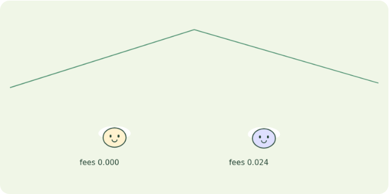
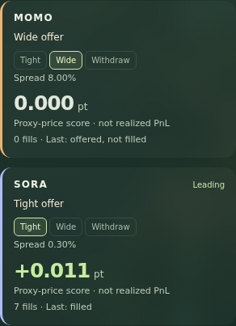
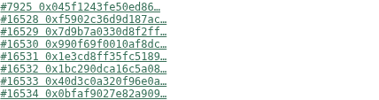
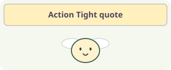
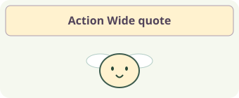
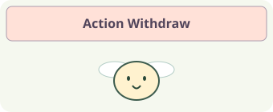
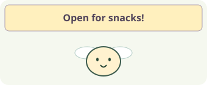
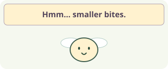
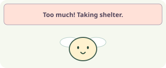

# 03 Aqua — offer or withdraw shared liquidity

Offer liquidity, widen it or withdraw?

Observe two flies respond to price changes with a tight offer, a wide offer or withdrawal. Follow actual test-token transactions alongside their evaluation.

[Full-neuron printable sheet](http://127.0.0.1:8812/guides/sheet.html?app=aqua&mode=full&lang=en) / [Legacy printable sheet](http://127.0.0.1:8800/guides/sheet.html?app=aqua&mode=browser&lang=en). Generated from the same content as in-app help. Use the sheet language selector for Japanese.

## 01 First run

1. On Aqua, press “Start autonomous run”. Decisions use a recorded price history.
2. Watch tight (30 bps), wide (800 bps) or withdraw choices, TXs, fills and proxy reward. Transaction processing makes this slower than Foraging.
3. Use “Learn again” to refit strategy selection. Follow the phase indicator, then compare adopted policies and evaluations after completion.

Select Stop to interrupt a run after the current action completes.

## 02 Reading the screen

These are actual screen captures. Numbers are examples from the capture time.

### 1. Controls

### 2. Agent field

### 3. State and results

### 4. Blockchain evidence

| Display | Meaning |
| --- | --- |
| Fly frames = selected strategies | The full app shows tight/wide/withdraw choices, spreads and fills. Price changes from a separate Uniswap pair serve as a proxy; the evaluation points are not realized PnL. |
| Flies = liquidity-control policies | Neural activity selects a strategy. Increasing virtual allocations against a shared wallet does not create additional real balance. |

### State and bubbles

Positive proxy reward maps to synthetic feeding and withdrawal to rest. Fullness and reserves feed the next input. Energy is fixed at 0.7 in full mode; the fly is not literally eating fees.

Tight quote offers a narrow spread; wide quote widens it; withdrawal removes the strategy. ? denotes training. These are action labels, not fear or desire decoded from named brain regions.

### Bubble reference

Illustrations match the actual labels. Full-mode action cards and legacy expressive bubbles are different displays.

#### Full app / reduced comparison: states and choices

**?**: The readout-training phase. Fly movement pauses. This does not cover the entire collection/evaluation job; a short fit may be easy to miss.

**Action Tight quote**: Offer liquidity at 30 bps. Inspect fills and TXs separately to confirm execution.

**Action Wide quote**: Offer at 800 bps. The simulated taker rule may leave the offer unfilled.

**Action Withdraw**: Withdraw the strategy; check confirmation of the dock TX. This is not evidence of fear.

#### Original browser app: bubbles

**Open for snacks!**: A ship proposal: scaled response below 0.045 and no strong raw response. This does not mean a fill occurred.

**Hmm… smaller bites.**: A cautious proposal: response at least 0.045 without triggering withdrawal. Uses a smaller virtual offer.

**Too much! Taking shelter.**: A dock decision when raw or scaled response reaches 0.1. Confirm the actual withdrawal through its TX.

### Scores and goals

Compare proxy reward: fill balance changes valued using the next Uniswap price ratio from another pair. Fees are gross fill differences. Neither metric establishes realized wallet PnL or LVR protection.

| Display | Meaning |
| --- | --- |
| fees | Cumulative input-minus-output amount in actual test fills. It excludes adverse valuation at the next price, so it differs from Reward. |
| Reward / proxy reward | Incremental fill balance changes valued at the next price ratio. Not total-wallet PnL, realized profit or an LVR estimate. |
| bps / fill condition | 100 bps = 1%. The experimental taker accepts wide quotes only when observed movement is at least 200 bps. This is a disclosed demand rule, not inferred market demand. |

## 03 Learn and try again

Collect: save real action observations and outcomes. Train: fit the readout from saved neural features and rewards. Evaluate: compare the current policy and candidate in another run. Only improved individuals adopt the new version for subsequent decisions. Neural connections remain fixed.

Evaluating means a candidate is being tested, not yet adopted. Complete means the run ended; Stopped means the user interrupted it. A ? indicates readout training and may be too brief to see when fitting finishes quickly.

Watch actions and fees, then inspect Status, strategy ship/dock and fill TXs. After training, compare proxy reward as well as fees.

## 04 Behind the application

### 1 Market to stimulus

Full mode maps price-change magnitude to 0–1. After the decision, it records the corresponding stimulus in a Status TX alongside the Aqua operation.

### 2 Circuit and readout

Direction/magnitude, fullness, reserves, fees and the previous fill become neural inputs for action selection.

### 3 Execute via the SDK

Full mode chooses a 30-bps tight quote, an 800-bps wide quote, or withdrawal. SDK ship/dock operations and accepted test-token fills are real transactions. Withdrawal also uses gas.

### 4 Evaluate actual outcomes

Actual fill balance changes are valued using a proxy based on the next Uniswap price and become learning rewards.

The chain lets you trace inputs and transactions. Neural computation, body updates and learning run locally. A successful transaction does not certify a correct decision or a profitable policy.

Full mode computes 166,700 classified neurons and 25,582,938 internal connections per individual. Sixteen inputs drive sensory populations; after four neural steps, activity summaries feed a learned action readout. A seven-neuron mode is an explicit alternative.

MaleCNS provides measured neural connectivity. Input mapping, activity dynamics, body state and action decoding are engineered for this experiment. Bubbles do not reveal a real fly’s emotions or thoughts.

| Display | Meaning |
| --- | --- |
| Policy v / version | The action readout version used for this decision, not neuron count or age. |
| Neural step / ms | Artificial model updates and neural computation time, not biological time or display FPS. |
| Before / Candidate / New test | Current-policy evaluation, candidate evaluation, and a new-input run after adoption. Values are MOMO / SORA cumulative rewards for each run. |
| TX / Block / hash | The transaction and block recording an input or trade. Anvil links open local receipts. The fly’s full neural state is not stored onchain. |

## Differences from the legacy browser version

1. Select an individual and risk level, send the stimulus and inspect its Status TX.
2. Inspect the response and proposal, then Apply. Use the separate test-fill control to inspect a receipt.
3. Use the learning button to fit gain on synthetic risk-target examples, not market returns.

Explore offers, withdrawals and fills. Response meters and learned gain are not investment returns.

The original browser apps use seven measured MaleCNS neurons and 19 connections. Their 32-step circuit response feeds action decoding. Input mapping and learning differ from the full-population apps.

- **1 Record stimulus**: The original app records a slider-driven artificial risk stimulus as Status and computes the MaleCNS response from that event. Unlike full mode, it does not automatically use market movement as input.
- **2 Compute response**: Individual sensitivity adjusts the input; the seven-neuron response and learned gain determine output.
- **3 Decode and apply strategy**: Decode ship/cautious/dock and spread; Apply sends actual Aqua transactions.
- **4 Inspect test fills**: Inspect test-token exchange and its receipt. Learning separately uses a synthetic risk-target curriculum.

Original learning fits a response gain to a synthetic risk-target curriculum. Lower error does not demonstrate improved trading returns. Applying and filling the displayed strategy are separate operations.

Reference implementation: full mode `services/full-apps/aqua.mjs`, neural inputs `packages/bio_agent/full_apps/brain.py`, learning `packages/bio_agent/full_apps/learning.py`. Guide content: `apps/frontend/guides/content.mjs`.
