# 01 採餌 — オンチェーン刺激の箱庭

蜜を集めて、生き延びよう

あなたは箱庭の環境を変える観察者です。ハエを方向キーで操作するのではなく、刺激を与え、2匹が自分で選ぶ移動・休息を見守ります。

[全神経版の印刷シート](http://127.0.0.1:8812/guides/sheet.html?app=foraging&mode=full&lang=ja) / [従来版の印刷シート](http://127.0.0.1:8800/guides/sheet.html?app=foraging&mode=browser&lang=ja)。画面内と同じ説明データから生成しています。英語はシートの言語選択で切り替えられます。

## 01 はじめてのプレイ

1. 刺激スライダーを決めて「刺激を送って観察」を押します。まずは中くらいの刺激から。
2. 金色の蜜と赤い点線の危険エリアを見ながら、2匹の採餌数・衝突数・Energyを比べます。通常実行は64ステップで終了します。
3. 「学び直す」を実行し、採用されたPolicyと評価結果を見ます。この学習は固定条件を使い、刺激スライダーの値では進みません。

途中で止めるには「停止」。進行中の動作が完了してから止まります。

## 02 画面の見方

実画面の切り抜きです。数値は撮影時の例です。

### 1. 操作する場所

### 2. ハエが反応する場所

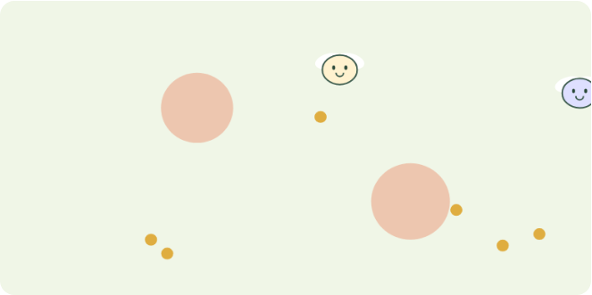

### 3. 状態と成績

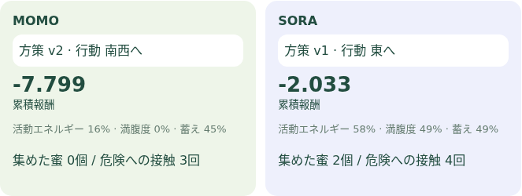

### 4. ブロックチェーンの証拠

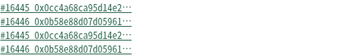

| 表示 | 意味 |
| --- | --- |
| 葉に乗った金色の結晶＝蜜 | チェーン接続時は、正の刺激の確定TXごとに1個出現します。食べると消え、自動補充しません。位置と消費はローカル計算です。オフラインの比較実験は合成の餌を使います。 |
| 赤い点線の輪＝危険地帯 | 位置と半径は環境TXの入力です。入ると減点とエネルギー消費。オンチェーンの刺激が強いほど衝突の罰が大きくなります。 |
| ハエ＝独立した個体 | それぞれ身体状態と方策を持ちます。同じ蜜を取り合うため、同じ刺激でも経験や判断は一致しません。 |

### 状態と吹き出し

Energyは動くための活動エネルギーで、移動で減り、休息や採餌で回復。満腹度は最近食べた量の指標で、採餌で増え、時間とともに減ります。蓄えは消化と消費でゆっくり変わり、体格の目標値になります。次の神経入力に入るのはEnergy・満腹度・蓄えです。個体のEnergy残量と、Statusのenergy（供給設定）は別の値です。全神経GUIの供給設定は固定。体格は蓄えから決まる表示用の指標で、従来版のお腹に反映されますが、全神経版の顔の大きさは現在固定です。

全神経版でもハエの上に状態を表示します。？＝readout学習中、♡＝蜜を獲得、！＝危険、すやすや＝休息、おなかいっぱい／空腹＝満腹度の閾値による表示です。使用したモデルや方策はⓘから確認します。感情を計測したものではなく、処理結果を人が読める表現に変えています。

### 吹き出し図鑑

実際の表示文言に合わせた説明用の模式図です。全神経版のカードと従来版の感情風の吹き出しは別の表示です。

#### 全神経版・7神経比較モード：状態と選択

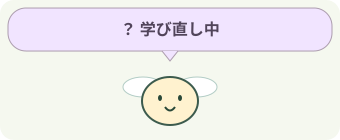

**？ 学び直し中**：readout学習中はその場で停止します。収集・評価中とは別の状態です。

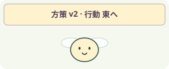

**！ あぶない**：直近の動作で危険領域に接触しました。

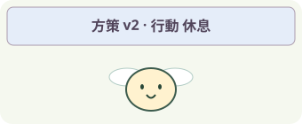

**♡ みつを見つけた！**：直近の動作でみつを取得しました。

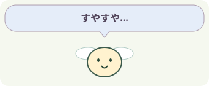

**すやすや…**：休息する行動を選びました。

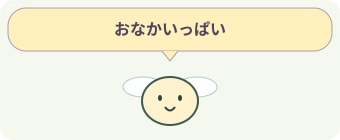

**おなかいっぱい**：満腹度が80%より高い状態です。

**おなかすいた…**：満腹度が15%未満です。

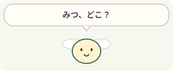

**みつ、どこ？**：ほかの表示条件に当てはまらない通常の状態です。

#### 従来のブラウザー版：吹き出し

**？ どうしよう…**：学習室で学び直し中。個体はその場で停止します。ほかの条件より優先して表示します。

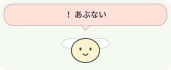

**！ あぶない**：直近の判断記録に「危険」がある状態。危険への接触などの結果を表示しており、未来の危険予知ではありません。

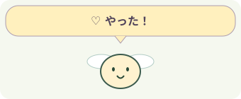

**♡ やった！**：直近の判断で蜜を獲得。満腹度の表示より優先されるため、満腹でも♡が出ることがあります。

**すやすや…**：直近の判断が休息。学び直しではなく、休む行動を見せています。

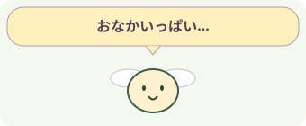

**おなかいっぱい…**：満腹度が80%より高いとき。学習・危険・獲得・休息の表示が優先されます。

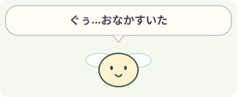

**ぐぅ…おなかすいた**：満腹度が15%未満。活動エネルギー残量やトークン残高の意味ではありません。

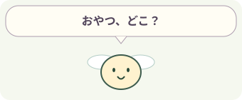

**おやつ、どこ？**：上の条件に当てはまらない通常の表示。食べ物の正確な位置を発見したという意味ではありません。

### 成績と目標

蜜の数だけでなく、危険への接触や移動コストも累積報酬に影響します。決まったクリア点はありません。2匹の結果と、学習前後の評価を比べる実験ゲームです。

| 表示 | 意味 |
| --- | --- |
| 蜜の数 / Score | 集めた蜜の個数。Rewardとは別です。 |
| Reward / 報酬 | 接近による小さな加点、蜜の獲得、危険による減点などの累積。蜜は満腹時ほど加点が小さくなります。 |

## 03 学び直して、もう一度

収集＝実際に動かして観測・行動・結果を保存。学習＝保存した神経特徴と報酬からreadoutを更新。評価＝別の実行で旧方策と候補を比較。改善した個体だけ採用し、v2などの方策番号が次の判断へ反映されます。神経接続そのものは固定です。

「評価中」は候補を試している途中で、まだ採用を意味しません。「完了」はその実行の終了、「停止」はユーザーの操作による中断です。？はreadoutを学習している間の表示で、短時間の学習では見えないこともあります。

①全神経を選ぶ → ②刺激を変えて「刺激を送って観察」 → ③蜜の数・身体状態・TXを確認 → ④「学び直す」で採用前後を見る。学習ボタンは比較用の固定条件を使い、スライダー変更は通常実行へ反映します。

## 04 ゲームの裏側

### 1 刺激を記録

スライダー → BioAgentStatusUpdatedのTX。全神経版の通常実行では0〜1を0〜10000として登録し、確認した値を入力へ戻します。

### 2 観測を入力へ

蜜の方向・距離、周囲の危険、エネルギー、満腹度、蓄え、刺激を人工的に数値化します。刺激を上げると移動入力が弱まり、危険の罰が増えます。「必ず右へ」などの命令ではありません。

### 3 回路から行動へ

MaleCNSの活動 → readout → 8方向の移動または休息。全神経版ではエネルギーが0.08未満なら休息だけを許すルールもあります。

### 4 結果から学ぶ

蜜の獲得、接近、衝突、休息の結果から報酬を計算し、次の学習に使います。描画と身体更新はオフチェーンです。

チェーンは入力や取引の出典を追うためのものです。神経計算・身体更新・学習はローカルで実行します。TX成功は、判断の正しさや利益を保証する印ではありません。

全神経モードは分類付き166,700神経・25,582,938内部接続を個体ごとに計算します。16入力を感覚神経集団に与え、4神経step後の活動集計をreadout（行動に変換する学習器）へ渡します。7神経モードも明示的に選択できます。

MaleCNSは実測された神経接続の地図です。入力を神経に割り当てる方法、活動の計算式、身体、行動への変換はこの実験の人工モデルです。吹き出しから本物のハエの感情や思考を読み取れるわけではありません。

| 表示 | 意味 |
| --- | --- |
| Policy v / 方策番号 | その判断に使った行動変換の版。神経数や年齢ではありません。 |
| 神経step / ms | 人工モデルの更新回数と神経計算時間。生物学的な時間や画面のFPSとは異なります。 |
| 学習前 / 候補 / 別条件 | 旧方策の評価、候補の評価、採用後の別入力での結果。各欄はMOMO / SORA順。数値はその実行の累積報酬です。 |
| TX / Block / hash | 入力や取引が記録されたトランザクションとブロック。Anvilではローカルreceiptを開きます。ハエの全神経状態がチェーンに保存されるわけではありません。 |

## 従来のブラウザー版との違い

1. 採餌・探索・休息を選び、刺激とエネルギー供給を調整して適用します。
2. 蜜を取ったときの♡、危険の！、休息、学び直しの？を観察します。チェーン接続時のおやつボタンも刺激TXを送ります。餌がないときは次のTXを待ちます。
3. 「学習室へ」で学び直しを試し、ラウンド終了後は学習を引き継いで次へ進みます。

採餌や危険への接触が成績に関係します。画面のラウンド成績と各個体の状態を比べてください。

従来のブラウザー版は実測MaleCNSの7神経・19接続を使います。32stepの回路応答を行動変換へ渡します。全神経版とは入力変換や学習方法が異なります。

- **1 個体の刺激TX**：刺激TXのreceiptとイベントを確認して個体の入力へ反映します。正の刺激1件につき蜜を1個追加。食べた蜜は自動補充せず、同じTXを再受信しても増えません。危険エリア・寸法・seedは環境TXに記録。餌の座標はTXとseedから計算し、消費は内部状態です。
- **2 身体と環境を観測**：蜜の方向、危険、活動エネルギー、満腹度と刺激を回路への人工入力にします。
- **3 7神経の応答から動く**：回路応答と学習したQ値から移動・休息を選び、ローカルの世界を更新します。
- **4 行動経験を学習**：採餌と衝突などの結果を記録し、成績下位の個体が学び直して改善を評価します。

ブラウザー版は経験からQ値を更新します。チェーン接続時は確認済み環境を複製して学習・比較し、表示中の餌は増やしません。比較条件で改善した候補だけ採用します。全神経版は別のreadout学習です。

参照実装：全神経版 `services/full-apps/foraging.mjs`、神経入力 `packages/bio_agent/full_apps/brain.py`、学習 `packages/bio_agent/full_apps/learning.py`。説明データは `apps/frontend/guides/content.mjs`。
