# 01 Foraging — an onchain stimulus playground

Gather nectar and keep going

You shape the environment. Set a stimulus and watch two flies choose movement or rest; there are no arrow-key controls.

[Full-neuron printable sheet](http://127.0.0.1:8812/guides/sheet.html?app=foraging&mode=full&lang=en) / [Legacy printable sheet](http://127.0.0.1:8800/guides/sheet.html?app=foraging&mode=browser&lang=en). Generated from the same content as in-app help. Use the sheet language selector for Japanese.

## 01 First run

1. Set the stimulus slider, then press “Send stimulus & watch”. Start near the middle.
2. Watch the golden nectar and red hazard rings. Compare food collected, collisions and Energy. A normal run ends after 64 steps.
3. Run “Learn again”, then inspect adopted policies and evaluation results. This uses fixed learning conditions, not the stimulus slider.

Select Stop to interrupt a run after the current action completes.

## 02 Reading the screen

These are actual screen captures. Numbers are examples from the capture time.

### 1. Controls

### 2. Agent field

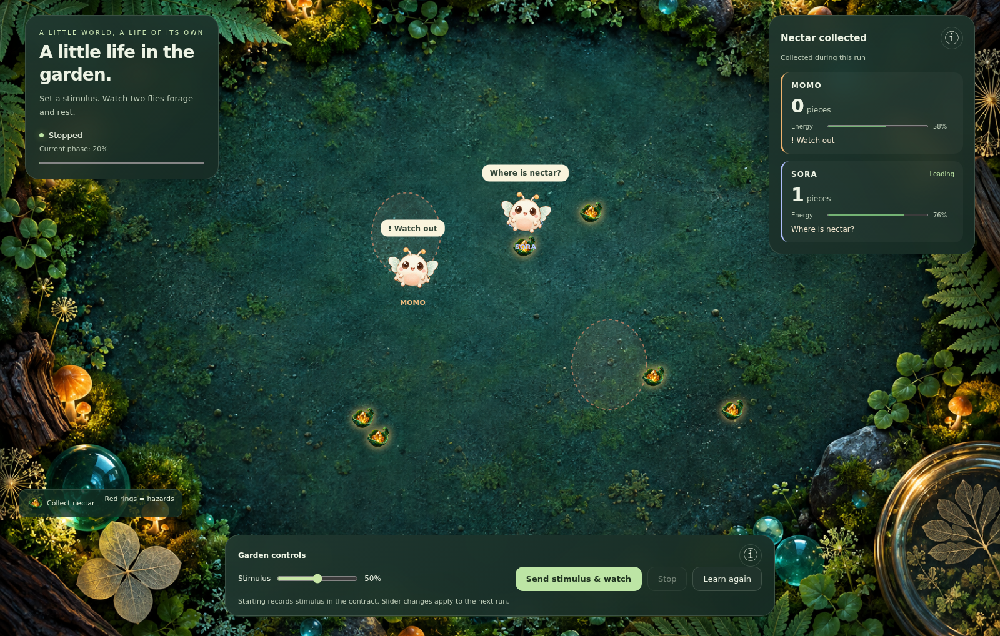

### 3. State and results

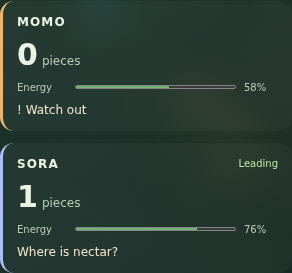

### 4. Blockchain evidence

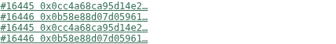

| Display | Meaning |
| --- | --- |
| Golden crystals on leaves = nectar | With a chain connection, each confirmed positive stimulus adds one food. Eating removes it without refill. Position and consumption are local calculations. Offline comparison experiments use synthetic food. |
| Red dashed rings = hazards | Position and radius come from the environment TX. Entering costs reward and energy. Stronger onchain stimulus increases the collision penalty. |
| Flies = separate individuals | Each has its own body state and policy. Shared food creates competition, so identical stimuli need not produce identical experiences or decisions. |

### State and bubbles

Energy supports activity: movement consumes it, while rest and feeding replenish it. Fullness tracks recent feeding and declines over time. Reserves change more slowly through digestion and expenditure and determine target body size. Energy, fullness and reserves feed subsequent neural inputs. Individual Energy differs from the Status energy supply setting, which is fixed in the full GUI. Body size derives from reserves for display: it changes the original app’s belly, while the full app currently draws faces at a fixed size.

The full app also shows state bubbles: ? for readout training, ♡ for nectar, ! for hazard contact, sleeping for rest, and full/hungry captions from fullness thresholds. Model and policy details live under ⓘ. These are readable labels for state and outcomes, not measured emotions.

### Bubble reference

Illustrations match the actual labels. Full-mode action cards and legacy expressive bubbles are different displays.

#### Full app / reduced comparison: states and choices

**? Learning**: Stops in place during readout training, distinct from collection or evaluation.

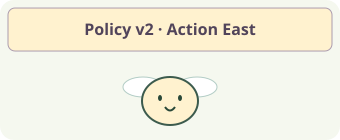

**! Watch out**: The last action contacted a hazard.

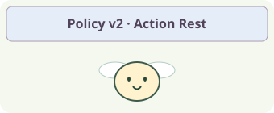

**♡ Found nectar!**: The last action collected nectar.

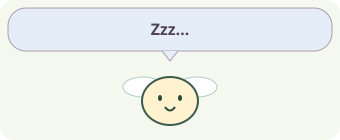

**Zzz…**: The selected action was rest.

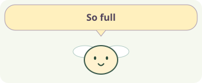

**So full**: Fullness is above 80%.

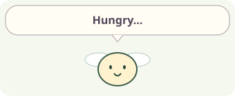

**Hungry…**: Fullness is below 15%.

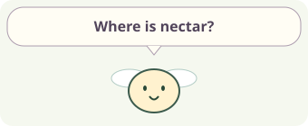

**Where is nectar?**: Default when no higher-priority state applies.

#### Original browser app: bubbles

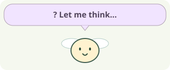

**? Let me think…**: Relearning in the learning room. The individual stops in place. This takes priority over other captions.

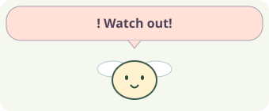

**! Watch out!**: The latest decision record contains a danger result, such as hazard contact. It is not a forecast.

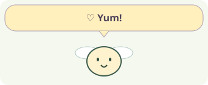

**♡ Yum!**: Nectar was collected in the latest decision. This takes priority over fullness captions.

**Zzz…**: The latest decision was rest, not relearning.

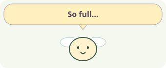

**So full…**: Fullness is above 80%, unless learning, danger, collection or rest takes priority.

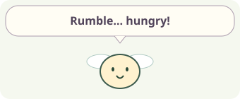

**Rumble… hungry!**: Fullness is below 15%. This is not remaining activity energy or a token balance.

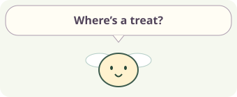

**Where’s a treat?**: The default caption when none of the above applies. It does not mean food has been located.

### Scores and goals

Nectar, hazard contact and movement cost all affect cumulative reward. There is no fixed winning score. Compare the two individuals and their before/after learning evaluations.

| Display | Meaning |
| --- | --- |
| Nectar count / Score | Number of nectar items collected; different from Reward. |
| Reward | Cumulative approach, food and hazard rewards/costs. Collecting food earns less reward when already full. |

## 03 Learn and try again

Collect: save real action observations and outcomes. Train: fit the readout from saved neural features and rewards. Evaluate: compare the current policy and candidate in another run. Only improved individuals adopt the new version for subsequent decisions. Neural connections remain fixed.

Evaluating means a candidate is being tested, not yet adopted. Complete means the run ended; Stopped means the user interrupted it. A ? indicates readout training and may be too brief to see when fitting finishes quickly.

1 Choose Full mode. 2 Change stimulus and run the current policy. 3 Inspect food count, body state and TX. 4 Collect → learn → evaluate to compare policies. Training uses fixed evaluation conditions; the slider affects normal runs.

## 04 Behind the application

### 1 Record a stimulus

Slider → a BioAgentStatusUpdated transaction. A normal full-app run records 0–1 as 0–10,000 and reads the confirmed value back into the input.

### 2 Encode the scene

Engineered inputs encode nectar direction/distance, hazards, energy, fullness, reserves and stimulus. Higher stimulus attenuates movement drives and increases hazard cost; it is not a command such as “turn right”.

### 3 Circuit to action

MaleCNS activity → readout → one of eight movement directions or rest. Full mode also allows only rest when energy falls below 0.08.

### 4 Learn from outcomes

Nectar collection, approach, collisions and rest produce rewards for learning. Rendering and body updates are offchain.

The chain lets you trace inputs and transactions. Neural computation, body updates and learning run locally. A successful transaction does not certify a correct decision or a profitable policy.

Full mode computes 166,700 classified neurons and 25,582,938 internal connections per individual. Sixteen inputs drive sensory populations; after four neural steps, activity summaries feed a learned action readout. A seven-neuron mode is an explicit alternative.

MaleCNS provides measured neural connectivity. Input mapping, activity dynamics, body state and action decoding are engineered for this experiment. Bubbles do not reveal a real fly’s emotions or thoughts.

| Display | Meaning |
| --- | --- |
| Policy v / version | The action readout version used for this decision, not neuron count or age. |
| Neural step / ms | Artificial model updates and neural computation time, not biological time or display FPS. |
| Before / Candidate / New test | Current-policy evaluation, candidate evaluation, and a new-input run after adoption. Values are MOMO / SORA cumulative rewards for each run. |
| TX / Block / hash | The transaction and block recording an input or trade. Anvil links open local receipts. The fly’s full neural state is not stored onchain. |

## Differences from the legacy browser version

1. First open “Environment and food input TXs” to inspect the initial hazard TX and food source TXs. Watching requires no wallet.
2. Select an agent and observe food, danger and rest. Manual stimuli and the snack button require an owner-signed TX. With no food, wait for the next TX; there is no refill.
3. Use “Start learning” to replay the confirmed environment, then read before/candidate and adopt/keep. This comparison alone does not establish unseen-world adaptation.

Foraging and hazard contact affect performance. Compare round results and individual states.

The original browser apps use seven measured MaleCNS neurons and 19 connections. Their 32-step circuit response feeds action decoding. Input mapping and learning differ from the full-population apps.

- **1 Individual stimulus TX**: A verified receipt and event update the individual’s input. Each positive stimulus adds one food, with no refill or duplicate addition. An environment TX records hazards, dimensions and seed. Food coordinates derive from TX data and that seed; consumption is internal state.
- **2 Observe body and scene**: Nectar direction, hazards, energy, fullness and stimulus become engineered circuit inputs.
- **3 Move from the seven-neuron response**: Circuit responses and learned Q values select movement or rest and update the local world.
- **4 Learn action experience**: Record feeding/collision outcomes; lower-ranking individuals retrain and are evaluated for improvement.

The browser updates Q values from experience. In chain mode, learning and comparison replay copies of the confirmed environment without adding visible food. Only a candidate with a better comparison score is adopted. The full runtime uses a separate readout learner.

Reference implementation: full mode `services/full-apps/foraging.mjs`, neural inputs `packages/bio_agent/full_apps/brain.py`, learning `packages/bio_agent/full_apps/learning.py`. Guide content: `apps/frontend/guides/content.mjs`.
