# 02 Market — paper trading in response to price changes

Buy, sell or wait: navigate the market

You observe a market experiment. Two flies read a price history and decide how to trade virtual funds; you do not directly place their trades.

[Full-neuron printable sheet](http://127.0.0.1:8812/guides/sheet.html?app=market&mode=full&lang=en) / [Legacy printable sheet](http://127.0.0.1:8800/guides/sheet.html?app=market&mode=browser&lang=en). Generated from the same content as in-app help. Use the sheet language selector for Japanese.

## 01 First run

1. On Market, press “Start battle” to replay confirmed local Uniswap price observations.
2. Compare the PnL lines with each fly’s buy/sell/hold action, position and paper PnL. Decision and execution occur at different observed blocks.
3. Use “Learn again” to refit trade decisions and inspect results on new evaluation inputs.

Select Stop to interrupt a run after the current action completes.

## 02 Reading the screen

These are actual screen captures. Numbers are examples from the capture time.

### 1. Controls

### 2. Agent field

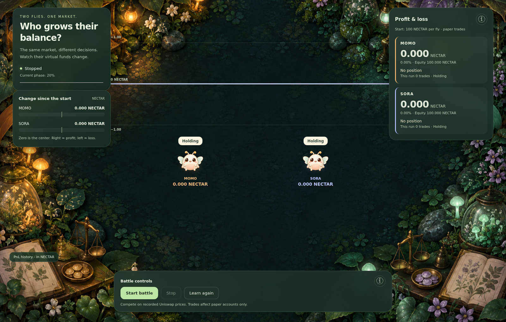

### 3. State and results

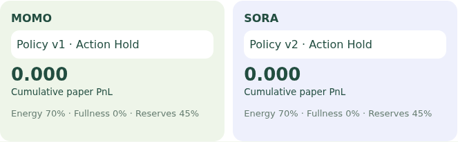

### 4. Blockchain evidence

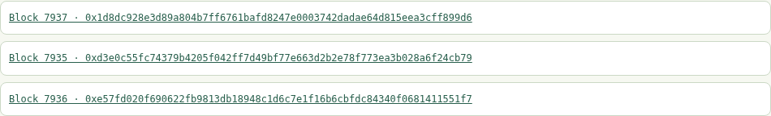

| Display | Meaning |
| --- | --- |
| Line = paper PnL | The full app charts each fly’s paper PnL relative to zero, in the displayed quote token (currently NECTAR), not ETH. Input prices come from Uniswap V3 history on Anvil. |
| Flies = paper accounts | Each individual holds virtual cash and a position. Visual bobbing is decorative, not order size or neural activity. |

### State and bubbles

Instead of collecting food, positive reward is mapped to synthetic feeding. Fullness and reserves affect subsequent decisions. Energy is currently fixed at 0.7 in the full app; it is not profit or confidence.

Hold means no trade, buy opens a paper position, sell closes it, and ? means learning. Learning does not eliminate existing position risk. These labels summarize actions, not evidence that the fly understands markets.

### Bubble reference

Illustrations match the actual labels. Full-mode action cards and legacy expressive bubbles are different displays.

#### Full app / reduced comparison: states and choices

**?**: The readout-training phase. Fly movement pauses. This does not cover the entire collection/evaluation job; a short fit may be easy to miss.

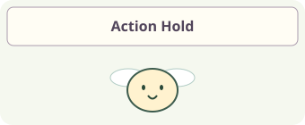

**Action Hold**: No trade on this decision. Hold can occur with or without a position.

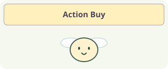

**Action Buy**: A paper buy decision. Execution is valued using a quote at a later observed block.

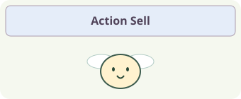

**Action Sell**: A choice to close a paper position, not a real-money sell transaction.

#### Original browser app: bubbles

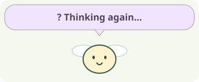

**? Thinking again…**: Relearning the trading policy. An existing position still carries price risk.

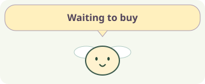

**Waiting to buy**: A buy is pending, awaiting a later Swap/quote for paper execution. It has not filled yet.

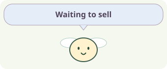

**Waiting to sell**: A sell is pending, awaiting a later Swap/quote for paper execution. It has not filled yet.

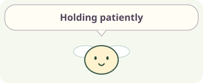

**Holding patiently**: There is no pending order and the fly holds paper tokens.

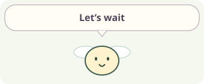

**Let’s wait**: Not learning, no pending order, and no token position.

### Scores and goals

Start with 100 virtual token1; buys use 10 token1 and only one position is held. Compare paper PnL including liquidation quotes, fees and assumed gas. This is not real-money trading or evidence of future profit.

| Display | Meaning |
| --- | --- |
| PnL | Paper equity minus the initial 100 token1. Positions are marked using liquidation quotes. This is not actual wallet profit. |
| Reward | Change in equity per decision, summing to run PnL. Gas is an explicit assumption of 0.001 token1 per trade. |
| Input TX versus order | The linked TX primarily witnesses the source Swap price. Fly trades are paper trades, not asset-moving order transactions. |

## 03 Learn and try again

Collect: save real action observations and outcomes. Train: fit the readout from saved neural features and rewards. Evaluate: compare the current policy and candidate in another run. Only improved individuals adopt the new version for subsequent decisions. Neural connections remain fixed.

Evaluating means a candidate is being tested, not yet adopted. Complete means the run ended; Stopped means the user interrupted it. A ? indicates readout training and may be too brief to see when fitting finishes quickly.

Follow price line → action label → PnL → source Swap TX. Then train and distinguish candidate improvement from results on new inputs.

## 04 Behind the application

### 1 Observe Swap

Read confirmed pool logs and block hashes. The full app replays recorded history; it is not a live external market feed.

### 2 Price changes and body

Encode up/down movement, magnitude, position, cash, fullness and reserves.

### 3 Circuit chooses a trade

Neural activity feeds a readout that chooses hold/buy/sell. The rules prohibit selling without a position and additional buying while already holding.

### 4 Evaluate at a later price

Full mode quotes at the next observed block and values at the following one. Changes in liquidation equity, including pool fees and price impact, become rewards.

The chain lets you trace inputs and transactions. Neural computation, body updates and learning run locally. A successful transaction does not certify a correct decision or a profitable policy.

Full mode computes 166,700 classified neurons and 25,582,938 internal connections per individual. Sixteen inputs drive sensory populations; after four neural steps, activity summaries feed a learned action readout. A seven-neuron mode is an explicit alternative.

MaleCNS provides measured neural connectivity. Input mapping, activity dynamics, body state and action decoding are engineered for this experiment. Bubbles do not reveal a real fly’s emotions or thoughts.

| Display | Meaning |
| --- | --- |
| Policy v / version | The action readout version used for this decision, not neuron count or age. |
| Neural step / ms | Artificial model updates and neural computation time, not biological time or display FPS. |
| Before / Candidate / New test | Current-policy evaluation, candidate evaluation, and a new-input run after adoption. Values are MOMO / SORA cumulative rewards for each run. |
| TX / Block / hash | The transaction and block recording an input or trade. Anvil links open local receipts. The fly’s full neural state is not stored onchain. |

## Differences from the legacy browser version

1. Choose a price-up, price-down or demo-market playback button.
2. Follow the input TX and flies moving between TOKEN1, TOKEN0 and OBSERVE states.
3. Inspect paper PnL and learning results. Adoption uses reward-prediction error, not guaranteed PnL improvement.

Compare virtual-account PnL. Price-changing swaps are real TXs; fly trades are paper trades.

The original browser apps use seven measured MaleCNS neurons and 19 connections. Their 32-step circuit response feeds action decoding. Input mapping and learning differ from the full-population apps.

- **1 Receive a real Swap**: Price controls cause real swaps in the test pool; confirmed logs become inputs.
- **2 Encode prices and body**: Price changes, holdings and fullness are encoded through the seven-neuron circuit.
- **3 Select a paper order**: The action policy selects hold/buy/sell and queues an order.
- **4 Fill at a later block**: A later-block quote provides paper execution and valuation, feeding reward-prediction learning.

The original app consumes real Swap logs and fills virtually using later-block quotes. Adoption is based on reduced reward-prediction error, which does not necessarily improve PnL.

Reference implementation: full mode `services/full-apps/market.mjs`, neural inputs `packages/bio_agent/full_apps/brain.py`, learning `packages/bio_agent/full_apps/learning.py`. Guide content: `apps/frontend/guides/content.mjs`.
