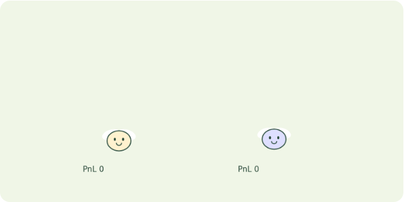
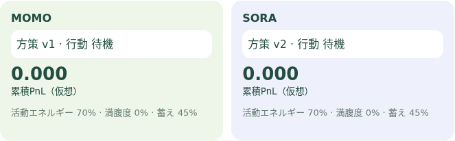
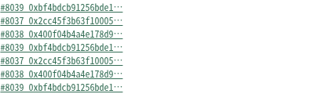

# 02 市場 — 値動きに反応するペーパートレード

買う？ 売る？ 待つ？ 相場を生き抜こう

あなたは相場実験の観察者です。価格履歴を読み、2匹が仮想資金で売買を判断します。直接売買ボタンを押してハエを操作するゲームではありません。

[全神経版の印刷シート](http://127.0.0.1:8812/guides/sheet.html?app=market&mode=full&lang=ja) / [従来版の印刷シート](http://127.0.0.1:8800/guides/sheet.html?app=market&mode=browser&lang=ja)。画面内と同じ説明データから生成しています。英語はシートの言語選択で切り替えられます。

## 01 はじめてのプレイ

1. 市場ページで「現在の方策で動かす」を押します。確認済みのローカルUniswap価格履歴を再生します。
2. 価格線と、各個体の買う・売る・待つ、保有状態、ペーパーPnLを見比べます。取引判断と約定にはブロックの時間差があります。
3. 「収集→学習→評価」で売買判断を学び直し、新しい評価入力で結果を確かめます。

途中で止めるには「停止」。進行中の動作が完了してから止まります。

## 02 画面の見方

実画面の切り抜きです。数値は撮影時の例です。

### 1. 操作する場所

### 2. ハエが反応する場所

### 3. 状態と成績

### 4. ブロックチェーンの証拠

| 表示 | 意味 |
| --- | --- |
| 折れ線＝観測した価格 | 全神経版はAnvil上の実Uniswap V3 Swap履歴を再生。token1 / token0の価格で、画面の線は取得したサンプルの相対表示です。未来の予測線ではありません。 |
| ハエ＝ペーパー口座 | 各個体は仮想現金と保有量を持ちます。上下に揺れる見た目は演出で、注文サイズや神経活動量ではありません。 |

### 状態と吹き出し

食べ物を集める代わりに、正の報酬を「食べた」という人工的な身体入力へ写します。満腹度・蓄えは次の判断へ戻ります。全神経版のEnergyは現在0.7固定で、利益や勝率を示すゲージではありません。

待機＝何もしない、買い＝ペーパー保有を作る、売り＝ペーパー保有を閉じる、？＝学習。学習中でも保有価格のリスクが消えるわけではありません。表示は選択した行動の要約で、ハエが市場を理解したという証拠ではありません。

### 成績と目標

初期資金は100 token1、買いは10 token1単位、保有は1ポジションです。売却見積もり・手数料・想定ガス代を含むペーパーPnLで比較します。実資金の売買や将来の利益を示すものではありません。

| 表示 | 意味 |
| --- | --- |
| PnL / 損益 | 初期100 token1に対する仮想資産の増減。保有は売却quoteで値洗いします。実ウォレットの利益ではありません。 |
| Reward / 報酬 | その判断による評価額の変化。累積するとその実行のPnLになります。ガスは取引ごと0.001 token1という仮定です。 |
| 入力TXと注文 | TXリンクは主に価格の出典となるSwapです。ハエの売買はペーパーなので、売買ボタンに対応する実資産の注文TXではありません。 |

## 03 学び直して、もう一度

収集＝実際に動かして観測・行動・結果を保存。学習＝保存した神経特徴と報酬からreadoutを更新。評価＝別の実行で旧方策と候補を比較。改善した個体だけ採用し、v2などの方策番号が次の判断へ反映されます。神経接続そのものは固定です。

「評価中」は候補を試している途中で、まだ採用を意味しません。「完了」はその実行の終了、「停止」はユーザーの操作による中断です。？はreadoutを学習している間の表示で、短時間の学習では見えないこともあります。

価格の線 → 行動名 → PnL → 元のSwap TXの順に見てください。次に学習を実行し、候補の改善と別条件の結果を分けて確認します。

## 04 ゲームの裏側

### 1 Swapを観測

実プールの確認済みログとblockHashを読みます。全神経版は保存した履歴の再生であり、外部市場のリアルタイム配信ではありません。

### 2 値動きと身体

上昇・下落・変動幅、保有の有無、現金、満腹度、蓄えを入力へ変換します。

### 3 回路が売買を選ぶ

神経活動をreadoutへ渡し、待機・買い・売りを選択。保有していなければ売れず、保有中は追加買いをしないルールです。

### 4 後の価格で評価

全神経版は次の観測ブロックでquoteし、その次で値洗い。手数料・価格影響を含む評価額の差を報酬として記録します。

チェーンは入力や取引の出典を追うためのものです。神経計算・身体更新・学習はローカルで実行します。TX成功は、判断の正しさや利益を保証する印ではありません。

全神経モードは分類付き166,700神経・25,582,938内部接続を個体ごとに計算します。16入力を感覚神経集団に与え、4神経step後の活動集計をreadout（行動に変換する学習器）へ渡します。7神経モードも明示的に選択できます。

MaleCNSは実測された神経接続の地図です。入力を神経に割り当てる方法、活動の計算式、身体、行動への変換はこの実験の人工モデルです。吹き出しから本物のハエの感情や思考を読み取れるわけではありません。

| 表示 | 意味 |
| --- | --- |
| Policy v / 方策番号 | その判断に使った行動変換の版。神経数や年齢ではありません。 |
| 神経step / ms | 人工モデルの更新回数と神経計算時間。生物学的な時間や画面のFPSとは異なります。 |
| 学習前 / 候補 / 別条件 | 旧方策の評価、候補の評価、採用後の別入力での結果。各欄はMOMO / SORA順。数値はその実行の累積報酬です。 |
| TX / Block / hash | 入力や取引が記録されたトランザクションとブロック。Anvilではローカルreceiptを開きます。ハエの全神経状態がチェーンに保存されるわけではありません。 |

## 従来のブラウザー版との違い

1. 「価格を上げる」「価格を下げる」、または「デモ相場を再生」を選びます。
2. 入力TXと、TOKEN1・TOKEN0・OBSERVEの場所へ移るハエの保有・観察状態を見ます。
3. ペーパーPnLと学習結果を確認します。学習採用は報酬予測誤差で判定され、PnL改善を保証しません。

仮想口座のPnLを比べます。価格を動かすSwapは実TXですが、ハエの売買はペーパートレードです。

従来のブラウザー版は実測MaleCNSの7神経・19接続を使います。32stepの回路応答を行動変換へ渡します。全神経版とは入力変換や学習方法が異なります。

- **1 実Swapを受け取る**：価格操作ボタンはテストプールで実Swapを起こし、確認済みログを入力にします。
- **2 値動きと身体を符号化**：値動き、保有、満腹度を7神経回路の応答に変換します。
- **3 仮想注文を選ぶ**：Q値などの行動変換から待機・買い・売りを選び、注文を保留します。
- **4 後のブロックで約定**：次のブロック以降のquoteで仮想約定と値洗いを行い、報酬予測を学びます。

従来版は実Swapログを受け、後のブロックのquoteで仮想約定します。報酬予測の誤差が減った候補を採用するため、採用がPnL改善を意味するとは限りません。

参照実装：全神経版 `services/full-apps/market.mjs`、神経入力 `packages/bio_agent/full_apps/brain.py`、学習 `packages/bio_agent/full_apps/learning.py`。説明データは `apps/frontend/guides/content.mjs`。
