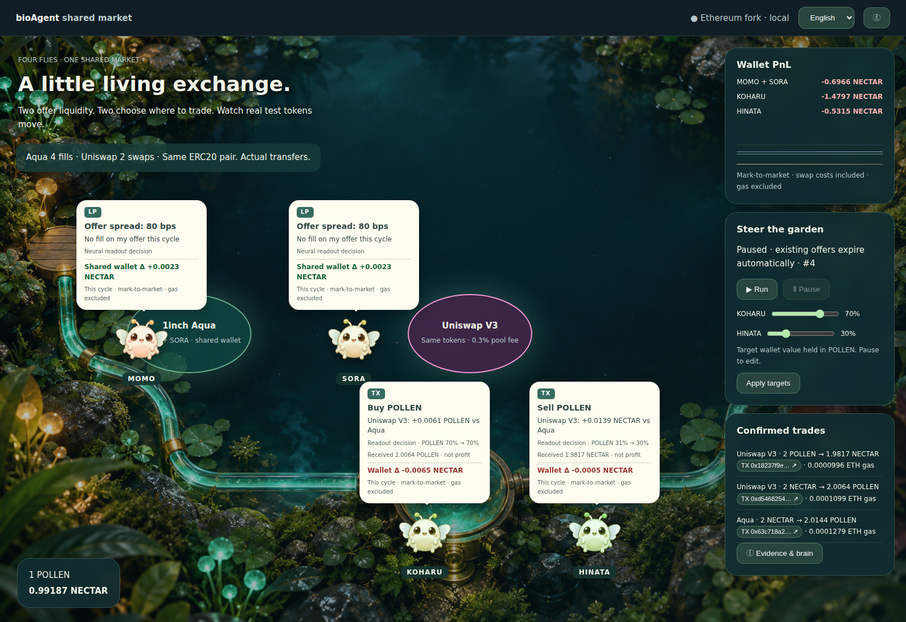
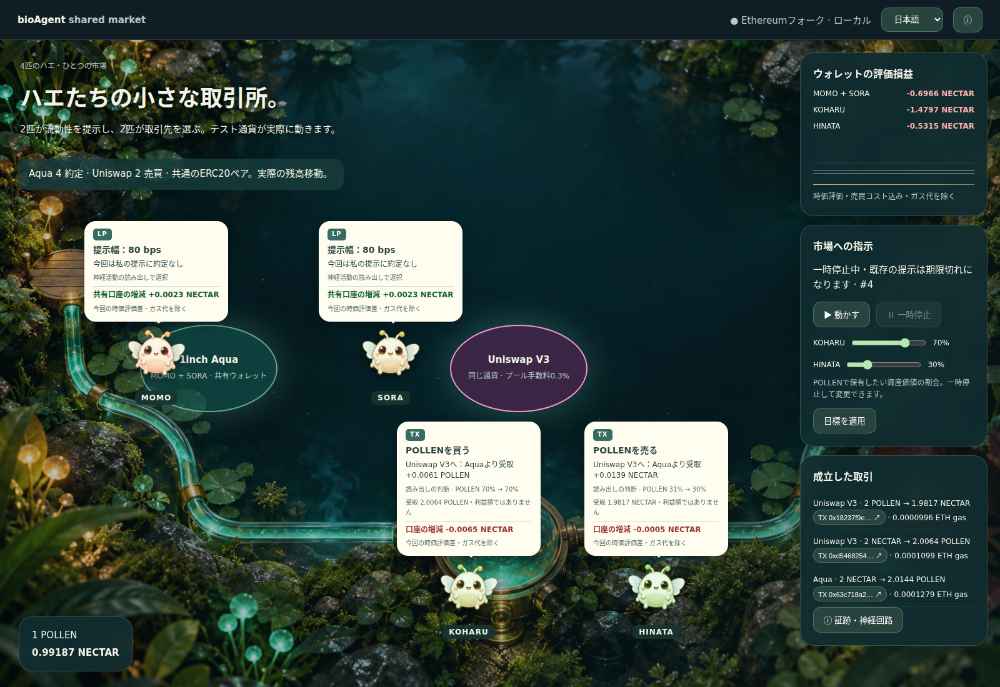

# Shared Market — 4匹のハエが同じ市場で実売買する

[60秒の英語デモ動画](../../submission/evidence/shared-market-demo-en.mp4) / [収録内容・再現手順](../../demo-video.md)

新しい統合モード: **http://127.0.0.1:8814/**。元の採餌・ペーパートレード・Aqua提出デモ（8812/8813）は残しています。このページは新モード専用です。



## 画面の読み方

| 画面の場所 | 意味 |
| --- | --- |
| 上段のMOMO・SORA | 同じmakerウォレットを使う2つのAqua提示戦略。個別の損益口座ではない |
| 左の1inch Aqua | ハエが選んだ提示条件でトークンを交換する場所。提示だけでは収入は発生しない |
| 右のUniswap V3 | **Aquaと同一アドレスの2通貨**を使うV3プール。手数料0.3% |
| 下段のKOHARU・HINATA | 別々のウォレットで実注文を出す2匹。各注文の受取量を比較して取引先へ移動する |
| 左下の価格 | 1単位の基準通貨を何単位の評価通貨と交換できるかのスポット価格。NECTAR/POLLENの順序は配置アドレスに依存する |
| Wallet PnL | 開始時からの**時価評価損益**。プラスは `+`、マイナスは `−`。単位は実トークンsymbol。ETHではない |
| グラフ | 上からのスコア順に、共有maker（緑）・KOHARU（黄）・HINATA（青）の評価損益推移 |
| 目標スライダー | 表示された基準通貨で資産価値の何%を保有したいか。これは人工的な取引需要の入力であり、将来価格の予測ではない |
| Confirmed trades | 実際に成立した交換。TXボタンから実ローカルreceipt、見積もり、出入金量、ガス代を開く |
| `ⓘ Evidence & brain` | 正式なAquaアドレス、トークンアドレス、MaleCNS計測、policy hash・学習回数 |

**Powered by Aqua — © Degensoft Ltd 2025.** テスト通貨に金銭的価値はありません。Etherscan上の取引ではなく、公式Ethereum Aquaを引き継いだ**ローカルAnvilフォーク**の実コントラクト実行です。

## 遊び方

1. `Run / 動かす` を押す。1回の操作で最大120周期、標準4秒周期で動く。
2. ハエが考え、Aquaの提示を更新し、KOHARU・HINATAが売買する様子を見る。
3. TXボタンで、どちらの経路を選び、何を何単位受け取ったか確認する。
4. 一時停止し、保有目標を変えて `Apply targets / 目標を適用` → 再開する。
5. 目標に近づくと待機することもある。約定ゼロは故障でも利益でもない。

停止要求は現在の周期が完了した時点で反映します。停止時に提示を強制撤回する追加TXは送りません。提示はチェーン時刻で90秒後に失効し、次の起動で旧提示をdockします。Anvilがブロックを生成していない間はチェーン時刻が進まないことがあります。

## 吹き出し



| 表示 | ハエの状態とオンチェーン処理 |
| --- | --- |
| `?` 考え中 / 学び直し中 | 価格・残高をMaleCNSへ入力、または結果からreadout更新。その場で揺れを止める |
| `LP` 提示幅 | 自分のAqua戦略の提示幅と、今回その戦略で何件成立したか。未約定は「約定なし」と表示 |
| `TX` 買う / 売る | 約定先へ移動し、「他の経路より受取 +数量」を表示。比較はガス代を除く見積もり |
| `受取数量` | 実receiptのトークン受取額。利益額ではないことを明記 |
| `口座の増減` | 今回の周期の開始から終了までの時価評価差。プラスは緑、マイナスは赤。ガス代は含まない |
| `共有口座の増減` | MOMO/SORAの共通ウォレット全体の時価評価差。個体別利益ではなく、未約定でも在庫価格で変化する |
| `WAIT` | その場で待機、発注なし。新たにUniswapへ移動しない |
| `探索行動` | 実験的な行動探索として選んだことを明記。保有比率と目標比率も併記 |

文字化けを避けるため、吹き出し内の絵文字を使わず、CSSと文字ラベルで表示します。スマートフォンでは重なりを避けて個体の位置を固定し、取引先は吹き出しに明記します。

これらは**実装した状態を表す演出**です。ハエの意識・感情や、個々の生体神経の思考内容を解読したものではありません。

## どこが実際につながったか

```text
同じV3プールの現在価格 + 各ウォレットの実残高 + 保有目標
  → 4個体のBioAgentStatus更新TX（receipt確認）
  → MaleCNS全分類付き166,700神経 × 4（個別の活動状態）
  → MOMO/SORA: 狭い提示 / 広い提示 / 撤回 → 公式Aqua ship/dock
  → KOHARU/HINATA: 待機 / 購入 / 売却
  → 同量のUniswap見積もりと有効なAqua見積もりを比較
  → 受取量が最大の経路へ実TX → ERC20残高が変化
  → 結果を保存・オンラインreadout更新 → 次の判断
```

- 取引相手はKOHARU/HINATA。外部ユーザーが参加しているという主張はしません。
- 1注文は入力2トークン。コントラクト上限10、minOutは見積もりの99.5%、発注期限30秒。
- Aqua提示はV3スポット価格を参照し、価格・spread・expiry・個体・刺激revision・model/policy hashをstrategyに含める。
- 刺激revision更新、提示期限切れ、在庫不足、allowance不足、dock済みの提示は使えない。
- V3は実coreコントラクト。独自のローカル専用アダプターがpool callbackを処理する。UniswapのAPIや本番Router APIを使う構成ではない。
- Quote選択はガス代を除いた受取量最大。マルチホップ、MEV対策、本番オラクル、クロスチェーンには未対応。
- 起動時にLP資金をseedし、各参加ウォレットは両通貨100ずつから開始。makerの余剰mint分は別の準備ウォレットに退避する。

## 損益と学習を混同しない

`評価損益 = 現在token0残高 × 現在V3価格 + token1残高 − 開始時評価額`

これは含み損益を含み、スワップ手数料・スプレッドが残高に反映されています。**ガス代を差し引いた確定利益ではありません**。ガスはTXごとにETHで表示します。makerとtakerを同じチームが運営するため、内部の売買だけで外部価値が生まれるわけでもありません。実検証でも3口座とも評価損失になりました。成功の基準は約定・状態・学習の接続であり、利益が出ることではありません。

新モードの学習データは `.local/shared-market/` に分離しています。従来Aqua/marketの学習済みpolicyを転用していません。

- 全MaleCNS接続行列を共有、4個体の神経状態は独立。2個体ずつ順番に計算し、各判断4神経step。
- 16入力を全感覚神経へ工学的に割当て。入力群・運動群・分類群の平均活動をreadoutに使う。
- 初期行動スコアは工学的設計。小さな正規化SGD補正を実結果から更新し、次の判断から使う。全コネクトームの再学習ではない。
- maker報酬はその提示で成立した交換の参照価格ベースの差額。trader報酬は目標比率への接近と同一参照価格での実行コスト。画面の評価損益とは異なる目的関数。
- `decisions.jsonl` に入力・神経特徴・選択・policy hash、`outcomes.jsonl` に実結果、`cycles.jsonl` に残高・TX・性能を保存。重みは `readout.json` に保存。
- **実験的オンライン適応**であり、未使用期間での収益改善・生物学的妥当性は未検証。従来アプリの候補評価・採用ゲートとは別方式。

## 起動・検証

MaleCNSのデータ準備は [全規模モデル手順](../../design/malecns-full-local.md) に従います。

```sh
# 公式Aquaフォークが未起動の場合。既に18551/8813で動作中なら再実行しない。
npm run submission:aqua

# 別ターミナル。既存のフォークへ追加配置する。既存アプリの資金・登録を変更しない。
forge build --root contracts
npm run shared:dev
# http://127.0.0.1:8814/

# 停止状態で実施。実際に12周期ぶんローカルトークンが動く。
npm run test:shared
```

`forge` がPATHにない場合は `export PATH="$HOME/.foundry/bin:$PATH"`。`SHARED_RPC_URL`、`SHARED_PORT`、`AQUA_FORK_MANIFEST`、`FULL_APPS_STATE_DIR` で分離できる。RPCはloopback、chainId31337、Anvil、既知の公式Aquaフォーク検証を必須とする。公開ネットワークへ送信しない。検証スクリプトは既定ポート8814を使用する。

再起動すると神経活動・画面の周期番号・約定カウンターは初期化され、学習重み・開始時評価額・チェーン残高は引き継ぐ。デモの資金を最初から作る場合は、既存ファイルを削除せず**新しいstate directory**を指定する。起動時に自動で初期資金を再配布しない。

## 2026-09-26の実測

- Foundry **12件成功**。実V3 coreで見積もりと受取量を比較、失敗時ロールバック・callback偽装・期限・capも確認。
- ブラウザ検証12周期を完走（先行運転を含む画面24周期）：Aqua **12約定**、Uniswap **35スワップ**。各個体の学習更新を確認。探索と永続重みにより再実行の件数は変動する。
- 4個体合計の神経計算中央値 **336.8 ms**、最大 **349.9 ms**。PythonピークRSS **443.2 MiB**。4秒の目標周期を満たす。30fpsの神経計算という意味ではない。
- 3ウォレット × 2トークンを、実Transferログから最小単位で再計算し、全残高が一致。
- 公式AquaのPushed/Pulled、V3 poolのSwapを実receiptで確認。Anvilの履歴bytecodeエラーで一部call traceは取れず、その範囲はreceipt証跡として明記。
- 英語/日本語・TXモーダル・説明モーダル・390pxモバイル幅でブラウザ例外・横はみ出しなし。

[残高照合・公式コントラクト証跡・性能JSON](accounting.json)。最新の詳細な実行結果は `artifacts/shared-market/verification.json`。
