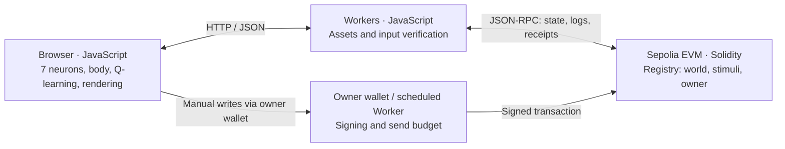
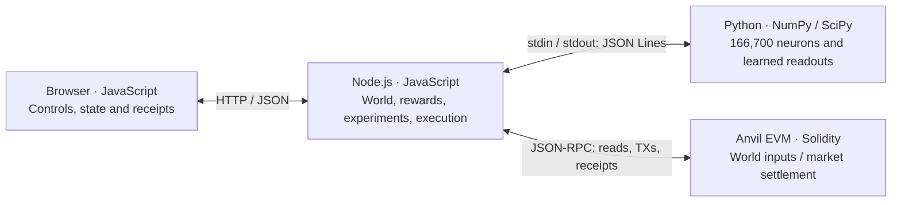

# Architecture: boundaries, languages and data flow

[Japanese](architecture.ja.md) · [Presentation appendix: slide 7](submission/presenter-kit/explanation-en.pdf) · [Project](../README.md)

**The chain stores inputs and enforces authority; runtimes compute decisions and learning; applications display and execute them.** Public mode computes in browser JavaScript. Full-neuron mode computes in local Python. Anvil and Sepolia share the common Fly Lab UI and learning code; the full-neuron recording applications have a separate runtime arrangement.

## 1. Where each component runs

| Boundary               | Language / runtime                                                       | Responsibility                                                                                                                   | Implementation                                                                                                                                                                                                                                |
| ---------------------- | ------------------------------------------------------------------------ | -------------------------------------------------------------------------------------------------------------------------------- | --------------------------------------------------------------------------------------------------------------------------------------------------------------------------------------------------------------------------------------------- |
| Browser                | JavaScript ES modules, HTML, CSS, Canvas                                 | Public: seven neurons, 19 edges, body state, Q-learning and rendering. Full mode: controls and server-state display              | [Shared UI](../apps/frontend/app.js), [Arena](../packages/bio_agent/browser/arena.js), [full UI](../services/full-apps/experience.mjs), [market UI](../services/shared-market/app.mjs)                                                        |
| Asset/read gateway     | JavaScript, Cloudflare Workers; local handler under Wrangler             | Serve assets; fetch and check snapshots, events and receipts. No neural inference                                                | [Sepolia Worker](../services/sepolia/worker.js), [Anvil adapter](../services/worker/local.js), [shared verification](../services/worker/registry-read.js)                                                                                     |
| Signer                 | JavaScript + ethers clients; owner wallet, Worker or local Anvil account | Manual/scheduled writes. Public Cron uses the owner EOA key, interval, gas and balance limits                                    | [Manual writes](../apps/frontend/chain.js), [scheduler](../services/sepolia/scheduler.js), [local market](../services/shared-market/chain.mjs)                                                                                                |
| Local controller       | JavaScript ES modules, Node.js                                           | Full-mode world, observations, rewards, learning orchestration, execution checks and TXs. Ordinary code compares Aqua/V3 routes  | [Full apps](../services/full-apps/server.mjs), [experiments](../services/full-apps/experiment.mjs), [market](../services/shared-market/server.mjs)                                                                                            |
| Full-neuron process    | Python, NumPy, SciPy, SQLite                                             | Fixed 166, 700-neuron connectivity, action readouts, experience and learning. Foraging selects candidates; market updates online | [Sparse model](../packages/bio_agent/full/model.py), [brain](../packages/bio_agent/full_apps/brain.py), [foraging learning](../packages/bio_agent/full_apps/learning.py), [market learning](../packages/bio_agent/full_apps/shared_market.py) |
| EVM                    | Solidity 0.8.30 for project-owned contracts                              | Identity, owner, modelHash, input state and world payload, revision/nonce checks; market offers and test-token settlement        | [Registry](../contracts/src/BioAgentRegistry.sol), [world input](../contracts/src/BioAgentStimulusRegistry.sol), [market/custom router](../contracts/src/SharedFlyMarket.sol)                                                                 |
| Shared libraries/types | JavaScript framework, proposed TypeScript types, JSON model artifacts    | Independent source adapters, learning lifecycle and format definitions; not a standalone network service                         | [JS Framework](../packages/bioagent-framework/README.en.md), [TypeScript types](../packages/shared/README.md)                                                                                                                                 |

JavaScript runs in Node.js, browsers and Workers, but these have separate processes, keys and storage. Shared TypeScript types are proposals with compile-time checks, not generated contracts for every service. Anvil/Foundry and Aqua/Uniswap are external dependencies; the Solidity version above describes our own contracts.

## 2. Public Sepolia / shared Fly Lab

1. The owner's initial TX records dimensions, seed, hazards and food-placement bounds.
2. The Worker checks chain, registry, model, receipts and blocks, returning JSON to the browser.
3. The browser checks identity, revisions and duplicates. Each confirmed positive stimulus TX adds one food. Full foraging reuses the same [world](../packages/bio_agent/browser/tx-world.js) and [food](../packages/bio_agent/browser/tx-food.js) transformations.
4. Encoding, neural processing, body updates, Q-learning and rendering execute in the browser. Training-world copies never add visible food.
5. Cron calls a dedicated Durable Object; the scheduled writer signs with the owner key stored as a Worker Secret. There is no public arbitrary-signing endpoint. Manual Sepolia writes are signed by the owner's browser wallet.

Local Anvil Fly Lab uses the same UI, computation and read-verification code. Chain ID, RPC/deployment settings, signing adapters and poll intervals differ. Local-only APIs are not exposed on the public deployment.

## 3. Full-neuron recording on local Anvil

- **UI ↔ Node.js:** controls use endpoints such as `/api/run`; polling `/api/state` updates the view. The full-mode UI does not compute Python inference itself.
- **Node.js ↔ Python:** [BrainClient](../scripts/full/brain-client.mjs) spawns a child and exchanges one JSON line per request/response over stdin/stdout, with `id` and `op`. Numeric observations and provenance go in; actions, policy versions and compute information come out. Outcomes/rewards return for learning. There is no HTTP inference service or message broker on this path.
- **Node.js ↔ EVM:** ethers handles reads, stimuli, execution and receipts. Python does not sign or transfer funds. Producing a decision does not grant execution authority.
- **Foraging:** Node.js builds the world from confirmed TXs and compares old/candidate readouts on identical world/stimulus TXs. Adoption is per agent. Body state, experience and rewards are computed locally.
- **Market:** neural readouts choose offer/withdraw or buy/sell/hold; Node.js performs ordinary executable-quote comparison and sends orders. MOMO/SORA share one maker EOA; KOHARU/HINATA have separate trader EOAs. Neural decisions and transaction settlement are separate stages.

Python is not hosted inside the public Worker. Full foraging's local Anvil and the market's Ethereum fork with official Aqua are separate local chains, shown sequentially in the video. Public Sepolia does not send Aqua/Uniswap orders.

## 4. State ownership

| Storage boundary                       | State                                                                                                                                    | Sharing                                                                      |
| -------------------------------------- | ---------------------------------------------------------------------------------------------------------------------------------------- | ---------------------------------------------------------------------------- |
| Chain state/events                     | Owners, modelHash, input revisions, initial world payload, stimuli; market balances and settlements                                      | Shared by readers of the same chain/contracts                                |
| Browser memory / localStorage          | Body/clock in memory; adopted policies and consumed-food IDs in localStorage                                                             | Browser-local; no automatic body or learning synchronization across browsers |
| Worker Secret / Durable Object storage | Owner key in Secret; send journal, budget and last result in DO storage                                                                  | Scheduled writer only; not a shared neural-state or policy database          |
| Local Python / Node.js                 | Fixed graph/state in RAM; foraging experience/policies in `experience.sqlite3`; market `readout.json`; cycles and evidence in JSON/JSONL | Local state directory; not stored onchain                                    |
| Model artifacts                        | Measured connectivity, manifests/hashes, Python NPZ/NPY files                                                                            | Distributed/prepared data; learning keeps neural wiring fixed                |

## 5. Interface and trust boundaries

- Solidity [`IBioAgent`](../contracts/src/interfaces/IBioAgent.sol) is an onchain input API; [`IBioAgentStimulus`](../contracts/src/interfaces/IBioAgentStimulus.sol) handles schema-tagged input. JavaScript `LearningBioAgent` provides an offchain lifecycle. They are not the same class or one shared learner.
- The independent JS framework uses seven neurons and offers source validation, training/evaluation/adoption and policy export/restore. Public Q-learning, full Python selection and market online updates have not been unified into that implementation.
- Contracts enforce owners, revisions/nonces and execution constraints. **No ZK proof or other EVM verification establishes neural inference or learning correctness.** `modelHash` binds model artifacts.
- Receipt/block checks still trust RPC and do not guarantee finality. Shared Fly Lab waits for a verified environment and resynchronizes from a snapshot after reorg/revision gaps; it does not exactly rewind past body or learning state.
- “All external inputs are onchain” describes the **chain-connected foraging world**. Body and policy are internal state. Independent research uses synthetic inputs, and market target holdings are operator settings; do not generalize that phrase unconditionally to every application.

[Local setup](deployment/local-anvil.md) · [Sepolia deployment/budget](deployment/sepolia.md) · [Full shared market](apps/shared-market/README.md) · [Framework API](../packages/bioagent-framework/README.en.md)
