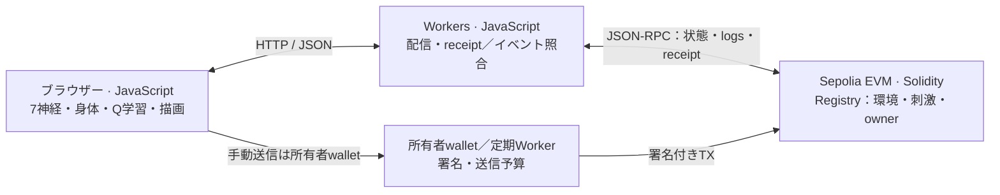
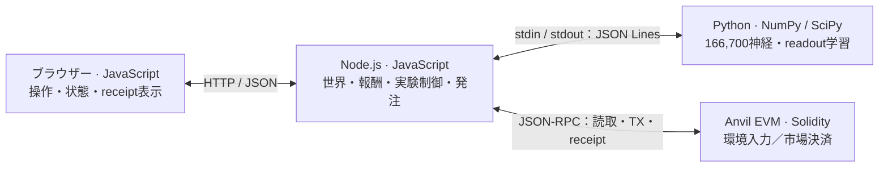

# アーキテクチャ：境界・実装言語・データの流れ

[English](architecture.en.md) · [発表スライド：付録7枚目](submission/presenter-kit/explanation-ja.pdf) · [プロジェクト概要](../README.md)

**チェーンは入力と権限、ランタイムは判断と学習、アプリは表示と実行を担当します。** 公開版はブラウザー内のJavaScript、全神経版はローカルのPythonで神経計算を行います。共通Fly LabのAnvil／Sepoliaは同じUI・判断・学習を使い、全神経の収録アプリは別の実行構成です。

## 1. 実行する場所と言語

| 境界 | 言語・実行環境 | 責務 | 主な実装 |
| --- | --- | --- | --- |
| ブラウザー | JavaScript ES modules、HTML、CSS、Canvas | 公開版：7神経・19接続の計算、身体、Q学習、描画。全神経版：操作とサーバー状態の表示 | [共通UI](../apps/frontend/app.js)、[Arena](../packages/bio_agent/browser/arena.js)、[全神経UI](../services/full-apps/experience.mjs)、[市場UI](../services/shared-market/app.mjs) |
| 配信・読取ゲートウェイ | JavaScript、Cloudflare Workers。ローカルはWrangler上の同形式ハンドラー | 静的配信、snapshot・イベント・receiptの取得と照合。神経計算は担当しない | [Sepolia Worker](../services/sepolia/worker.js)、[Anvil adapter](../services/worker/local.js)、[共通読取検証](../services/worker/registry-read.js) |
| 署名者 | JavaScript＋ethersの送信コード、所有者wallet／Worker／ローカルAnvilアカウント | 手動または定期TX。公開Cronは所有者EOAの鍵、送信間隔、ガス・残高制限を使う | [手動送信](../apps/frontend/chain.js)、[定期送信](../services/sepolia/scheduler.js)、[ローカル市場送信](../services/shared-market/chain.mjs) |
| ローカルの実行制御 | JavaScript ES modules、Node.js | 全神経版の世界・観測・報酬、学習工程、実行条件、TX。Aqua／V3の経路比較も通常コードが担当 | [採餌等のサービス](../services/full-apps/server.mjs)、[実験制御](../services/full-apps/experiment.mjs)、[共有市場](../services/shared-market/server.mjs) |
| 全神経の計算プロセス | Python、NumPy、SciPy、SQLite | 166,700神経の固定接続計算、行動readout、経験保存・学習。採餌は候補の比較・採用、市場は結果によるオンライン更新 | [疎行列モデル](../packages/bio_agent/full/model.py)、[用途別の脳](../packages/bio_agent/full_apps/brain.py)、[採餌学習](../packages/bio_agent/full_apps/learning.py)、[市場学習](../packages/bio_agent/full_apps/shared_market.py) |
| EVM | 自作コントラクトはSolidity 0.8.30 | 個体・owner・modelHash・入力状態・環境payload、revision/nonce検査。市場では提示やテスト通貨の決済 | [Registry](../contracts/src/BioAgentRegistry.sol)、[環境入力](../contracts/src/BioAgentStimulusRegistry.sol)、[共有市場・独自router](../contracts/src/SharedFlyMarket.sol) |
| 共通ライブラリ・型 | JavaScriptフレームワーク、TypeScriptの共有型仕様、JSONモデル成果物 | 独立した入力アダプターと学習ライフサイクル、データ形式の記述。独立したネットワークサービスではない | [JS Framework](../packages/bioagent-framework/README.md)、[TypeScript型](../packages/shared/README.md) |

JavaScriptはNode.jsとブラウザーとWorkersで動きますが、同じ言語でもプロセス・鍵・保存先は異なります。TypeScript型は仕様案・コンパイル検証用で、すべてのサービスがその型から生成される構成ではありません。Anvil／FoundryやAqua／Uniswapは外部依存です。上のSolidityバージョンは自作部分を指します。

## 2. 公開版：Sepoliaと共通Fly Lab

1. 所有者の初期TXが幅・高さ・seed・危険エリア・餌配置範囲を記録します。
2. Workerがchain・registry・model・receipt・ブロック等を照合し、JSONをブラウザーへ返します。
3. ブラウザーが同一性・revision・重複を検査し、確認済みの正の刺激TXから餌を1個追加します。[環境変換](../packages/bio_agent/browser/tx-world.js)と[餌変換](../packages/bio_agent/browser/tx-food.js)は全神経の採餌でも使います。
4. 感覚変換、神経計算、身体更新、Q学習、描画はブラウザー内で実行します。学習用の環境コピーは表示中の餌を増やしません。
5. 定期送信はWorkerのCronから専用Durable Objectを呼び、Worker Secretの所有者鍵で送信します。一般のHTTP利用者が署名要求を渡すAPIではありません。手動Sepolia送信は所有者のブラウザーwalletが署名します。

Anvilの共通Fly Labは同じUI・計算・読取検証を使います。chain ID・RPC・配置情報・署名アダプター・確認間隔が異なり、公開版にローカル専用APIは公開しません。

## 3. 全神経版：ローカルAnvilの収録環境

- **UI ↔ Node.js：** 操作を`/api/run`等へ送り、`/api/state`をポーリングして表示。全神経UI自体でPythonの計算を代行しません。
- **Node.js ↔ Python：** [BrainClient](../scripts/full/brain-client.mjs)がPython子プロセスを起動し、`id`・`op`付きJSONを1行ずつstdin/stdoutで交換します。数値観測・出典を送り、行動・方策version・計算情報を受け取ります。結果・報酬を再送して学習します。HTTP推論サーバーやメッセージブローカーは使いません。
- **Node.js ↔ EVM：** ethersで読取・入力送信・実行・receipt確認を行います。Pythonは署名・送金を行いません。モデルの出力だけで取引権限は得られません。
- **採餌：** Node.jsが確認済みTXから世界を構築し、新旧方策を同じ環境・刺激TXで比較します。候補採用は個体別です。身体・経験・報酬はローカル計算です。
- **市場：** 神経readoutが提示／撤回、購入／売却／待機を選択し、Node.jsが通常の見積もり比較と発注を行います。MOMO/SORAは共通maker EOA、KOHARU/HINATAは別のtrader EOAです。定期的な神経判断と送信・決済は別の段階です。

公開WorkersにはこのPythonプロセスを配置していません。全神経採餌のローカルAnvilと、公式Aquaを読む市場のEthereum forkは別チェーンです。動画は両方を連続して見せています。公開SepoliaはAqua／Uniswap注文を送りません。

## 4. 状態を誰が保持するか

| 保存先 | 状態 | 共有範囲 |
| --- | --- | --- |
| チェーンの状態・イベント | 個体owner、modelHash、入力revision、初期環境payload、刺激。市場では残高・決済 | 同じchain／contractを読む利用者で共有 |
| ブラウザーのメモリー・localStorage | 身体・時計はメモリー、採用済み方策・消費済み餌IDはlocalStorage | ブラウザーごと。身体・学習状態は他ブラウザーへ自動同期しない |
| Worker Secret / Durable Object storage | 所有者鍵はSecret、定期送信のjournal・予算・直近結果はDO storage | 定期送信サービス。神経状態・学習方策を共有するDBではない |
| ローカルPython / Node.js | 固定グラフ・状態はRAM、採餌経験と方策は`experience.sqlite3`、市場readoutは`readout.json`、周期等はJSON/JSONL | 指定されたローカルstateディレクトリ。オンチェーン保存ではない |
| モデルファイル | 実測由来の接続、manifest・hash、Python用NPZ/NPY等 | 配布・準備済みモデル。神経接続は学習で変更しない |

## 5. インターフェースと信頼の境界

- Solidityの[`IBioAgent`](../contracts/src/interfaces/IBioAgent.sol)はオンチェーン入力API、[`IBioAgentStimulus`](../contracts/src/interfaces/IBioAgentStimulus.sol)はスキーマ付き入力です。JavaScriptの`LearningBioAgent`はオフチェーンのライフサイクルです。同じクラスや同じ学習器を継承している、という意味ではありません。
- 独立JSフレームワークは7神経の研究基盤です。入力取得、検証、学習・評価・採用、方策export/restoreを提供します。公開Q学習・全神経Python・市場のオンライン更新まで単一実装へ統合したわけではありません。
- コントラクトはownerやrevision/nonce、実行条件を検査します。**神経推論・学習結果の正しさをEVM上で検証するZK証明等はありません。** `modelHash`は成果物の照合に使います。
- receipt・ブロック照合はRPCへの信頼が残り、最終確定を保証しません。共通Fly Labは未確認の環境で停止し、reorgやrevision欠番でsnapshotから再同期します。身体・学習を過去へ厳密に巻き戻す処理ではありません。
- 「ハエへの外部入力はすべてオンチェーン」は**チェーン接続された採餌環境**の説明です。身体・方策は内部状態です。独立研究は合成入力を使い、市場の目標保有比率はオペレーター設定なので、その説明を全アプリへ無条件に広げません。

[ローカル起動](deployment/local-anvil.md) · [Sepoliaの配置・予算](deployment/sepolia.md) · [全神経の共有市場](apps/shared-market/README.md) · [フレームワークAPI](../packages/bioagent-framework/README.md)
