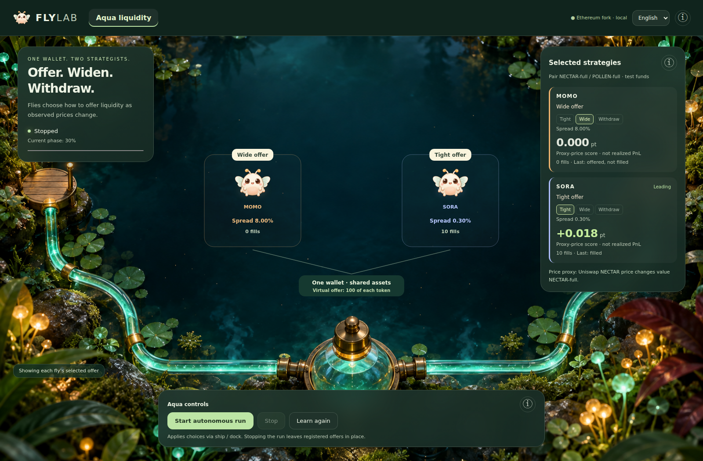
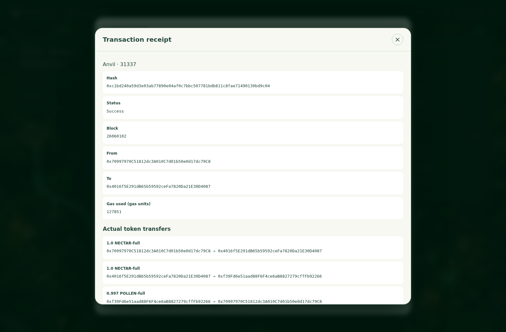

# 1inch submission — BioAgent Aqua

**提出の要点：MOMOとSORAのMaleCNSベースの判断が、同じ自己管理ウォレットに結び付く2つのAqua戦略を更新する。公式AquaのEthereum配置をlocal forkで利用し、テストトークンの実決済を示す。**

## 今回の確認結果と提出リンク

- **コード**：[Polonity/ethglobaltokyo2026-bio-agent](https://github.com/Polonity/ethglobaltokyo2026-bio-agent)
- **英語デモ（46.84秒）**：[公式Aqua forkでの判断と実決済](evidence/aqua-official-fork-en.mp4)
- **固定fork**：Ethereum block **26,058,941**。[ブロック・コードhash](evidence/upstream.json)
- **実GUI**：MOMO/SORAが各166,700神経で19ステップ。10件の交換、70件のship/dockイベントを確認。
- **決済証拠**：全Transferをmaker/taker残高差分に照合。代表TXのcall traceは `safeBalances → push → pull`。[検証JSON](evidence/verification.json)
- **Foundry**：公式配置のforkテスト6件成功。[実行ログ](evidence/foundry-fork-tests.txt)
- **再現用policy**：[収録に使用した2個体の学習済みreadout](evidence/aqua-policies.json)。元の学習DBや観測履歴を共有する必要はない。





## 応募欄に使う英語

BioAgent Aqua turns measured biological connectivity into an onchain liquidity controller. MOMO and SORA each run a model using all 166,700 classified MaleCNS neurons. Application-specific learned readouts choose a tight offer, a wide offer, or withdrawal. The two strategies share a single maker wallet through Aqua's virtual balances; shipping an offer does not escrow the wallet's tokens.

Our custom AquaFlyApp binds each strategy to an agent identity, an input revision and a policy digest. A new confirmed stimulus invalidates an old revision. Updates dock the previous strategy and ship a new immutable strategy. Accepted test fills settle atomically through the official Aqua contract's push/pull functions.

The demo uses the canonical Ethereum Aqua deployment, 0x1111113ccf1426a8e30e2bff5e005d929bf6a90a, on an Anvil local fork. The UI shows the selected strategies and opens receipts with ERC20 transfers. Our verification reconciles those transfers against maker/taker balances and traces the call into official Aqua. Foundry tests cover shared liquidity, withdrawal, stale input rejection, insufficient funds, immutable strategies and slippage/identity checks.

This is an engineered research prototype: market stimuli, taker behavior and the test-token exchange rate are controlled. Measured connectivity is real; dynamics, sensory mappings and motor readouts are engineered. Saved learned policies are reused in the recorded demo. We do not claim biological fidelity, profitable market making, mainnet trading, or SwapVM integration.

## 要件との対応

[公式の1inch募集ページ](https://ethglobal.com/events/tokyo2026/prizes#1inch)を2026-09-26に確認。

| 募集要件 | 実装・提示方法 | 根拠 |
| --- | --- | --- |
| Aquaを使ったDeFiポジションを、テストまたはUIで示す | 同じmakerの資金を共有する2戦略。30/800bps提示と撤回を学習済みreadoutが選び、agent・入力revision・policyを戦略に結び付ける | `services/full-apps/aqua.mjs`、`chain.mjs`、`contracts/src/AquaFlyApp.sol` |
| 公式Aqua/SwapVMコントラクトを使用 | **公式Aquaの正規アドレスをEthereumからfork。Aqua本体の再配置・etchは行わない** | `services/full-apps/fork.mjs`、upstream block/hash/codeHash |
| 最終デモでオンチェーンのトークン移動を示す（local fork可） | GUIの実交換→receipt内のTransfer→maker/taker残高差分→Aqua push/pull call trace | `npm run test:submission:aqua`、英語動画、検証JSON |
| 適切なGit履歴 | 9月25日の初期設計から段階的な実装・検証コミット | `git log --reverse --date=iso-strict` |
| SwapVMの利用は加点 | 今回は独自AquaFlyAppを使用。SwapVM未導入 | 必須と加点を区別する。SwapVM採用とは記載しない |

「sophisticated」の評価や受賞は審査員の判断。提案するDeFiポジションは、固定ペアの2つの仮想流動性戦略を、状態revisionの整合性と学習readoutによって更新する仕組み。MEV防御や新しいAMM数式を実装したという説明はしない。参加登録に応じて通常／Continuityトラックを選び、既存素材・データの出典を申告する。

## 公式配置と互換性

[公式AquaのDeployments](https://github.com/1inch/aqua#deployments)が示す正規アドレスを使用する。古い資料の `0x499943…` や、従来デモが新規Anvilに配置したアドレスは提出用経路では使用しない。

起動時にEthereum chain ID、固定したforkブロックのhash、正規アドレスのruntime code hashを保存し、Anvilが実際にforkであることと照合する。空コード・別アドレス・異なるブロック／コードを拒否する。既存ABI/SDKと正規配置の互換性は、実ship/dock/push/pullとFoundryで検証する。公開チェーンに書き込む操作は一切ない。

## 再現手順

前提：このリポジトリのNode依存、Foundry、MaleCNS全規模データ・Python環境が準備済み（[全規模セットアップ](../design/malecns-full-local.md)）。GUI検証と録画にはChrome、Playwright、ffmpegが必要。

```sh
npm ci
npm run submission:aqua
# 別ターミナル
npm run test:submission:aqua
```

- 提出用GUI：<http://127.0.0.1:8813/aqua>
- 提出用Anvil：`127.0.0.1:18551`、chain ID 31337、Ethereum由来のlocal fork
- 保存先：`.local/aqua-fork/`、`artifacts/aqua-fork/`
- 既存3アプリ：`8812`／`18550`を継続使用。提出用の状態と学習DBは分離。
- 初回は既存学習DBがあればSQLite backupを作る。採用済みAqua policyがなければ、同梱の2個体のreadoutを復元する（brainHashとartifact hashを検証）。既存の採用済みpolicyは上書きしない。これは学習の再実行ではない。
- `AQUA_UPSTREAM_RPC`でEthereumのarchive対応RPCを指定できる。既定は公開dRPC。RPC鍵を提出資料に含めない。
- `AQUA_FORK_BLOCK`で固定ブロックを指定できる。省略時は起動時のfinalizedを取得し記録。
- 空きポートを確認し、既存サービスがあれば起動を中止する。Ctrl+Cで提出用子プロセスを停止。

提出用GUIはAqua専用。ローカルのUniswap V3テストプールに作った確認済みSwapログを刺激として使う。これはメインネット市場の実時系列ではない。Anvil forkの過去時点で新規V3 bytecodeを呼ぶquoteに制約があるため、ペーパートレードは既存8812で行う。Aquaの決済証拠はfork内の現在の実TXから取る。

## 60秒程度の説明順

1. 「2匹、1つのwallet」。MOMO/SORAと選択中の提示を見せる。
2. **Start autonomous run**。MaleCNSの出力で提示が登録され、テスト交換が成立する。
3. 停止→ⓘ→**Evidence**。Ethereum fork・公式Aquaのアドレス・Etherscanリンクを示す。
4. 成功した交換TXを開き、**Actual token transfers**で入金／出金の単位と経路を示す。fork内TXなのでそのTX自体はEtherscanには存在しない。
5. 「Aquaが共有資金と決済を担当し、BioAgentが戦略を選ぶ」。学習済みpolicyの利用と人工市場の範囲を一言添える。

停止は推論ループの停止であり、全提示の撤回ではない。提示の更新時はdock→shipを行う。撤回・stale input・資金不足の安全性はFoundryの独立forkテストで示す。

## 提出物

`npm run test:submission:aqua` は、公式forkのFoundry 6テスト、実GUI操作、ERC20残高の照合、代表TXのcall traceを実行し、以下を生成する。

- `artifacts/aqua-fork/aqua-official-fork-en.mp4`：英語GUIデモ
- `artifacts/aqua-fork/verification.json`：fork・神経数・policy・TX・残高・call trace
- `artifacts/aqua-fork/upstream.json`：正規配置の固定ブロックとコードhash
- `artifacts/aqua-fork/foundry-fork-tests.txt`：Foundryの結果
- `artifacts/aqua-fork/*-en.png`：実画面

検証したスナップショットは `docs/submission/evidence/` に同梱する。フォームには上記の公開GitHubリポジトリと動画のリンクを添付できる。今後の再実行は `artifacts/aqua-fork/` を更新するため、提出する証拠を更新する際は同梱版も揃える。ETHGlobalフォームの提出ボタン操作はこのコマンドには含めない。

Powered by Aqua — © Degensoft Ltd 2025. MaleCNS: FlyEM / HHMI Janelia and dataset contributors; see the project's data attribution.
