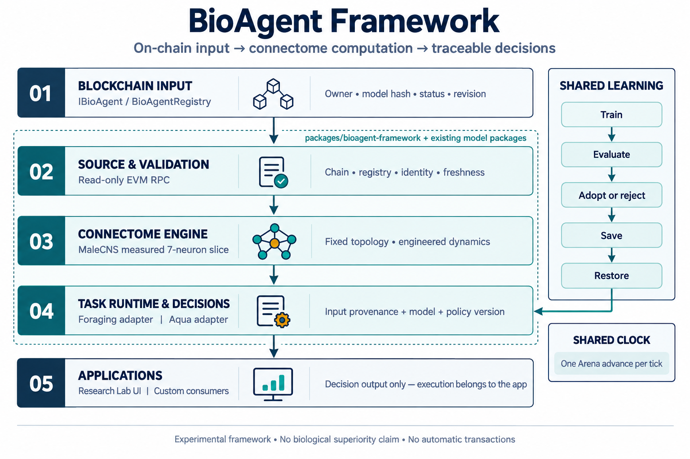

# BioAgent Framework

An experimental monorepo framework that receives on-chain BioAgent state, runs a fly-derived connectome, and returns traceable decisions. Foraging and Aqua adapters share candidate training, evaluation, adoption and policy save/restore.

[Japanese API guide](README.ja.md) · [Research findings](../../docs/research/bioagent-adaptation/README.md)

## Layers



Generated with the built-in imagegen tool. [Exact prompt](docs/imagegen-prompt.txt).

| Layer                 | Responsibility                                                            | Implementation                                       |
| --------------------- | ------------------------------------------------------------------------- | ---------------------------------------------------- |
| Blockchain input      | Owner, model hash, status and revision                                    | Existing `IBioAgent` / `BioAgentRegistry`            |
| Source and validation | Read a pinned block; check chain, registry, identity, model and freshness | `EvmBioAgentSource`, `ChainDecisionRunner`           |
| Connectome engine     | Measured MaleCNS slice, fixed topology, engineered dynamics               | Existing `male-cns.js` / `circuit.js`                |
| Task runtime          | Task-specific encoding and decisions; common learning lifecycle           | `LearningBioAgent`, `ForagingBackend`, `AquaBackend` |
| Applications          | Display, record and consume decisions                                     | Research Lab and custom consumers                    |
| Shared clock          | One Arena advance per tick                                                | `SharedArenaClock` for existing foraging adapters    |

The Solidity interface describes **inputs**. The JavaScript class inherits the existing off-chain `IBioAgentRuntime`. This release uses a measured **7-neuron, 19-edge slice**. The existing 166, 700-neuron runtime is separate and has not been integrated into this framework. Neither is a claim to reproduce a biological fly's thinking.

## Run from the repository root

Requires Node.js 22.14+; the package is private and currently uses sibling monorepo packages.

```sh
npm ci
npm run test:framework
npm run research:adaptation
npm run test:framework:chain       # requires Forge and Anvil; isolated local chain only
npm run test:framework:browser
npm run framework:lab             # http://127.0.0.1:8826/
```

The bilingual UI lets you train, evaluate, adopt or reject, save and restore policies for two different task engines. Its controls use local simulation. The chain section replays archived records from an actual local Registry deployment, at the original block timestamps. It is not a live RPC connection.

## Integrate

Use `LearningBioAgent(identity, backend)` with `observe`, `step`, `snapshot`, `train`, `evaluate`, `adopt`, `exportPolicy` and `restorePolicy`. See the [working API example](#common-api). Policies bind identity, task, model, encoder, dynamics, readout and action space. Restore rejects incompatible artifacts and discards pending candidates. It restores a policy, not the full environment state. SHA-256 checks content integrity; it is not an author signature.

Read a compatible deployed Registry without a key or signer:

```sh
node packages/bioagent-framework/examples/read-chain.mjs \
  RPC_URL CHAIN_ID REGISTRY_ADDRESS AGENT_ID aqua 2
```

The adapter requires both `getAgent` and `getStatus`; not every bare `IBioAgent` implementation supplies the metadata extension. `2` means reading two blocks behind head, not guaranteed finality. Use explicit `0` for immediate local-chain checks. Model hashes must match the configured slice; the runner verifies the actual graph bytes before decisions and caches the successful check. The default freshness window is 120 seconds from the sampled block timestamp. Rollback/conflicting observations are rejected; automatic deep-reorg recovery is not implemented. The RPC is trusted; externally supplied JSON is not proof of chain state.

Outputs contain input provenance, model/mapping identifiers and policy version/hash. The framework performs **no transaction, signing or approval**. Execution authorization and latest-state checks remain the consuming application's responsibility. `SharedArenaClock` avoids duplicate environment stepping through its API; do not mix it with direct legacy `step()` calls.

## What the experiments establish

With 5 search seeds and 60 unseen worlds per profile, default-profile mean reward rose **18.79 → 56.12**, food **6.80 → 20.84**, and contacts **1.25 → 0.10**. Three readout coefficients were fitted; neural topology remained fixed. Direct-input controls reached **56.08**, so biological superiority was not established. A particular fixed rule scored **49.05** with slightly fewer contacts (**0.083**); the learner did not dominate every metric. The added hazard guard did not change these results. Reduced resting was the visible behavioral change, with a cost: final energy fell 0.722 → 0.361 and low-energy ticks rose 0 → 48.50. An optional final-energy adoption floor can reject such tradeoffs and is included in artifact compatibility.

The result is a reusable framework for **traceable decisions and measurable adaptation**, not evidence of trading profitability, router adoption, LLM-equivalent performance or energy savings. The approximately 600-byte policy artifact is not a runtime RAM measurement. [Detailed results and limitations](../../docs/research/bioagent-adaptation/README.md).

## Common API

Run this example from an ESM file at the repository root. AquaBackend uses the same lifecycle; this does not transfer learned skills between tasks.

```js
import { LearningBioAgent } from './packages/bioagent-framework/src/index.js';
import { ForagingBackend } from './packages/bioagent-framework/src/adapters.js';

const agent = new LearningBioAgent(
  { id: 'fly-1', owner: '0x1111111111111111111111111111111111111111' },
  new ForagingBackend({ seed: 42 }),
);
agent.observe({ activity: 2, energy: 7000, stimulus: 5500 });
const profiles = [{ name: 'default', energy: 0.7, stimulus: 0.55 }];
agent.train({ seed: 310001, seeds: [311000, 311019], profiles, ticks: 300, trials: 16 });
const selection = agent.evaluate({ seeds: [312000, 312019], profiles, ticks: 300 });
const adoption = agent.adopt(); // Keep the previous policy if the gate fails
const artifact = await agent.exportPolicy();
await agent.restorePolicy(artifact);
console.log({ selection, adoption, decision: agent.step(), state: agent.snapshot() });
```

| API                                  | Responsibility                                                                                |
| ------------------------------------ | --------------------------------------------------------------------------------------------- |
| observe(status)                      | Pass conditions to the backend; use ChainDecisionRunner for chain provenance                  |
| step(0.2) / snapshot()               | Next decision / current state; adopted policies apply at the next decision                    |
| train(config)                        | Produce a candidate without changing the active policy                                        |
| evaluate(config)                     | Compare current/candidate on the same selection cases; reject overlap with training seeds     |
| adopt()                              | Apply only an evaluated candidate that passes the task gate                                   |
| exportPolicy() / restorePolicy(json) | Preserve identity, task, model, encoder, dynamics, readout, action-space and version bindings |

Foraging requires better reward, no fewer food items, and no more contacts in each selection profile. Optional `minimumFinalEnergy` adds a mean-energy floor and forms part of artifact compatibility; an example value is not a recommendation. Aqua gates on synthetic-target MSE. Research Lab's in-memory save is temporary; persist exportPolicy JSON in application storage for durable reuse.

## Shared environment clock

Use SharedArenaClock with existing ForagingBioAgent adapters to advance one Arena exactly once per tick. Repeating the same tick does nothing. Do not also call legacy agent.step/arena.tick in that loop. This API does not prevent direct legacy access or unify clocks for adapters with different freshness rules.

## Add a backend

Implement binding, initial, validate, fit, evaluate, gate, observe, step, and snapshot; see src/adapters.js. Binding defines task/mapping/dynamics/output compatibility. Fit must not consume evaluation data; evaluate compares current/candidate under matched conditions; gate includes adverse effects. Backends are trusted code, not sandboxed plugins. Large asynchronous training and model distribution are outside this release.
